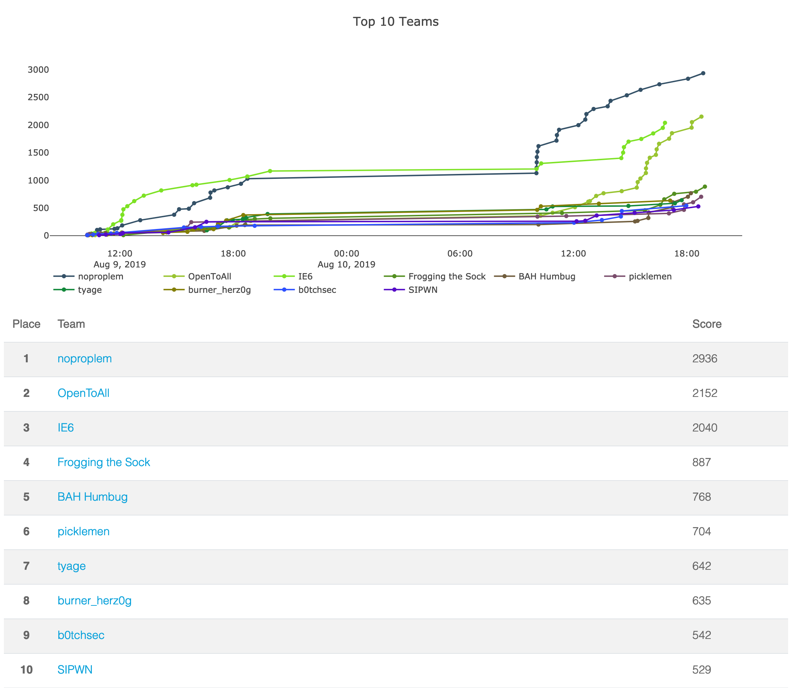
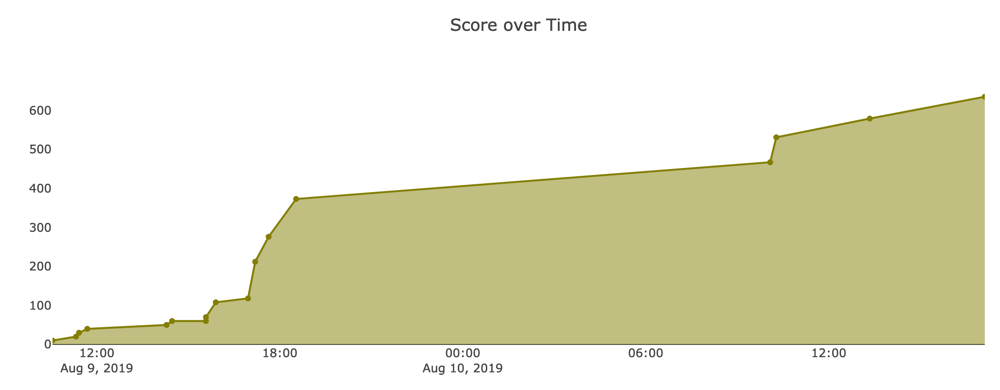
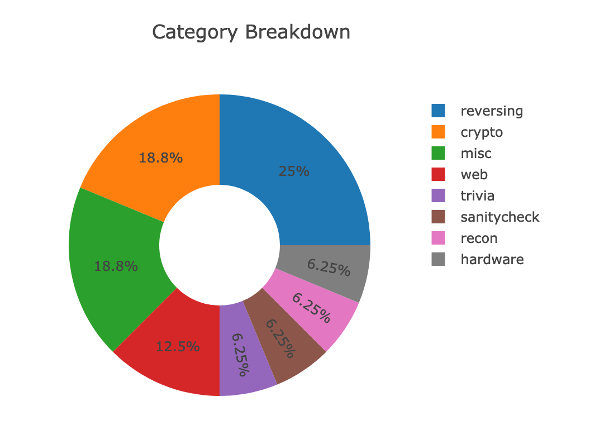

# DEFCON 27 OpenCTF
Fri, 09 Aug. 2019, 10:00 UTC — Sat, 10 Aug. 2019, 20:00 UTC 

<https://www.openctf.cat/>

<https://ctftime.org/event/861>

Team: [burner_herz0g](https://ctftime.org/team/63292)

# Summary

## Reverse Engineering

* [antisat](antisat/)
* [tellme](tellme/)
* [tellmemore](tellmemore/)

## Cryptography

* [baby_secret](baby_secret/)

# Ranking
We placed 8th out of 229 scoring teams :)

# Lessons Learned

