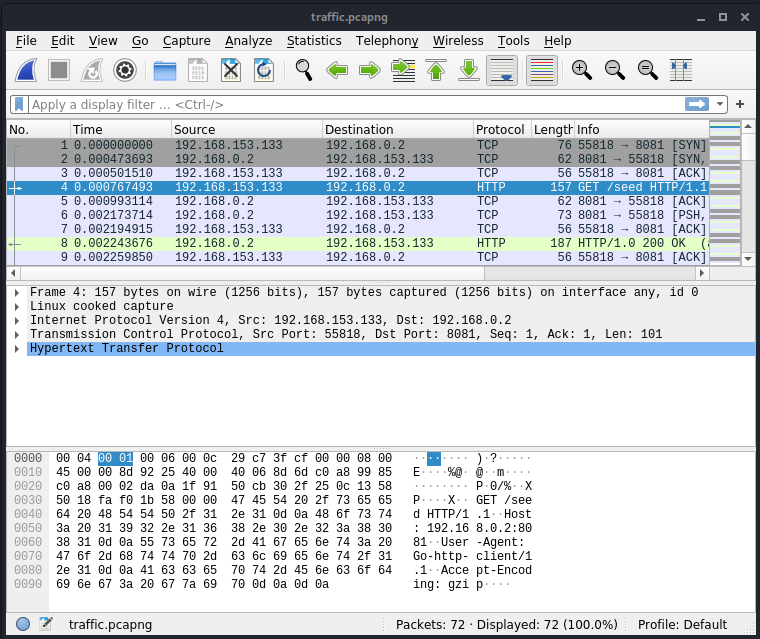
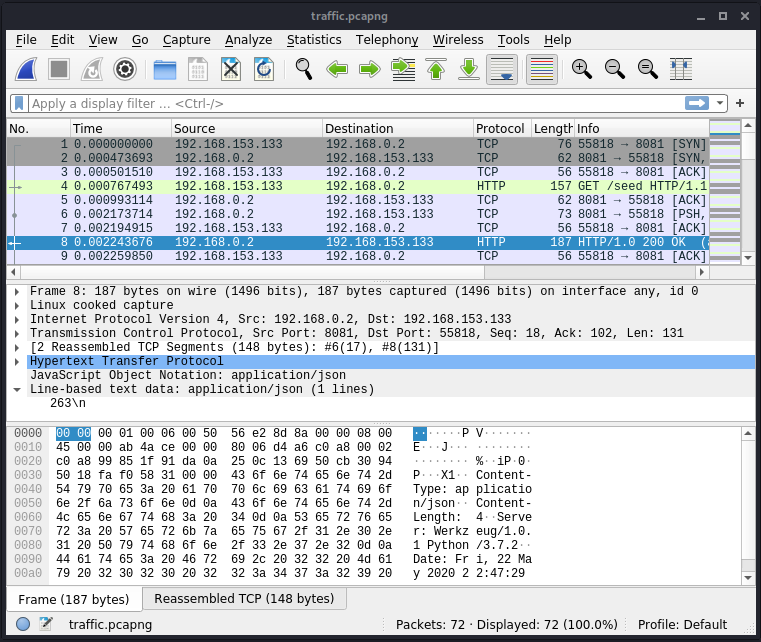
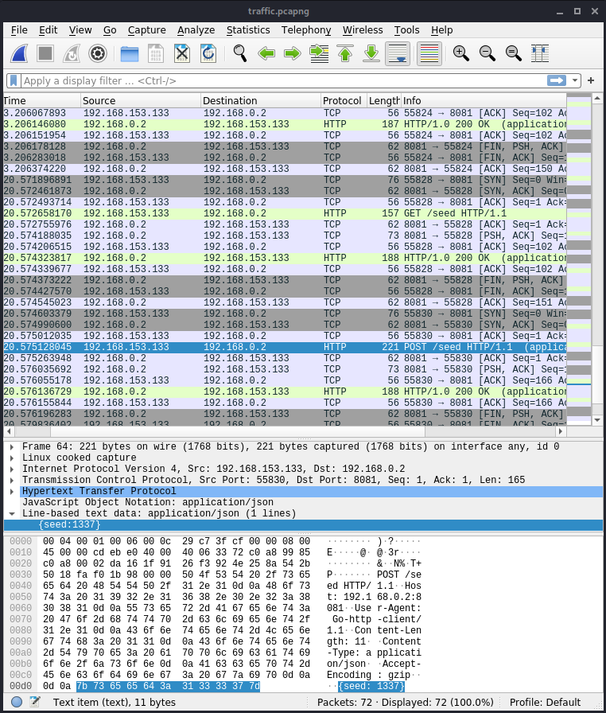
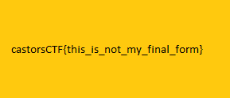

# Ransom

## Description

Author: Krekel

Agent, we raided one the hideouts of a wanted cyber criminal. During the raid, we extracted what appears to be a POC ransomware. It appears the he left a picture for us, but it is encrypted. It is your task to reverse engineering this sample and find out what secrets lie within the file. We managed to capture some network traffic generated by the malware. Use it during your investigation.

We are counting on you.

## What are we dealing with?

On its surface, this sounds really similar to [NotWannasigh](https://github.com/dobsonj/ctf/tree/master/writeups/2020/wpictf/NotWannasigh). NotWannasigh generates a seed, sends the seed to a remote server, and uses that seed in an XOR cipher to encrypt the flag.

What do these files look like?

```
kali@kali:~/Downloads/castors/ransom$ ls -l
total 6884
-rw-r--r-- 1 kali kali    1441 May 30 10:07 flag.png
-rwxr-xr-x 1 kali kali 7032295 May 30 10:07 ransom
-rw-r--r-- 1 kali kali    8624 May 30 10:07 traffic.pcapng
kali@kali:~/Downloads/castors/ransom$ file ransom 
ransom: ELF 64-bit LSB executable, x86-64, version 1 (SYSV), dynamically linked, interpreter /lib64/ld-linux-x86-64.so.2, Go BuildID=OkZVlnHVsFk7SwMgDFUE/zOQleogVV1bY3TRRt3zB/eokanke6dUV5eVl_GLmS/lAUrQjYXz8GBWDb_7NcR, not stripped
kali@kali:~/Downloads/castors/ransom$ file flag.png 
flag.png: data
kali@kali:~/Downloads/castors/ransom$ file traffic.pcapng 
traffic.pcapng: pcapng capture file - version 1.0
```

We have an encrypted `flag.png`, a traffic capture which must have the key, and the binary. Ew, a 7 MB Go binary.

## Analysis

Open the binary in Ghidra and let it analyze. This takes a few minutes to run. Look for main and these 4 functions immediately stick out:

* main.encrypt
* main.getSeed
* main.main
* main.send

Let's start with `main.encrypt`:

```
void main.encrypt(char *__block,int __edflag)

{
  ulong *puVar1;
  bool bVar2;
  ulong uVar3;
  long lVar4;
  long *plVar5;
  long in_FS_OFFSET;
  long *local_4d8;
  ulong local_4c8;
  long local_4c0;
  byte local_480 [24];
  undefined local_468 [1008];
  ulong local_78;
  ulong local_70;
  long local_68;
  long local_58 [2];
  long local_48;
  long local_38;
  ulong local_28;
  undefined **local_20;
  ulong local_18;
  undefined **local_10;
  
  puVar1 = (ulong *)(*(long *)(in_FS_OFFSET + 0xfffffff8) + 0x10);
  if (local_468 < (undefined *)*puVar1 || local_468 == (undefined *)*puVar1) {
    runtime.morestack_noctxt();
    main.encrypt(__block,__edflag);
    return;
  }
  local_28 = 0;
  local_20 = (undefined **)0x0;
  local_18 = 0;
  local_10 = (undefined **)0x0;
  math/rand.();
  os.OpenFile();
  local_70 = local_4c8;
  if (local_4c0 != 0) {
    local_38 = local_4c0;
    if (local_4c0 != 0) {
      local_38 = *(long *)(local_4c0 + 8);
    }
    local_4c8 = 1;
    fmt.Fprintln();
  }
  local_10 = &PTR_os._006dab40;
  local_18 = local_70;
  os.OpenFile();
  local_78 = local_4c8;
  if (local_4c0 != 0) {
    local_48 = local_4c0;
    if (local_4c0 != 0) {
      local_48 = *(long *)(local_4c0 + 8);
    }
    local_4c8 = 1;
    fmt.Fprintln();
  }
  local_20 = &PTR_os._006dab40;
  local_28 = local_78;
  runtime.duffzero(0,local_480);
  plVar5 = local_4d8;
  while( true ) {
    uVar3 = local_4c8;
    local_4d8 = (long *)0x0;
    os.();
    if (local_4c0 == 0) {
      bVar2 = false;
    }
    else {
      if (io.EOF._0_8_ == local_4c0) {
        local_4d8 = io.EOF._8_8_;
        runtime.ifaceeq();
        bVar2 = true;
      }
      else {
        bVar2 = true;
      }
    }
    if (bVar2) {
      local_58[0] = local_4c0;
      if (local_4c0 != 0) {
        local_58[0] = *(long *)(local_4c0 + 8);
      }
      local_4d8 = local_58;
      local_4c8 = 1;
      fmt.Fprintln();
    }
    if (uVar3 == 0) break;
    lVar4 = 0;
    while (lVar4 < 0x400) {
      local_480[lVar4] = local_480[lVar4] ^ (byte)plVar5;
      math/rand.();
      lVar4 = lVar4 + 1;
      plVar5 = local_4d8;
    }
    if (0x400 < uVar3) {
      runtime.panicSliceAcap();
      runtime.deferreturn();
      return;
    }
    os.();
    if (local_4c0 != 0) {
      local_68 = local_4c0;
      if (local_4c0 != 0) {
        local_68 = *(long *)(local_4c0 + 8);
      }
      local_4c8 = 1;
      fmt.Fprintln();
    }
  }
  os.();
  os.();
  return;
}
```

It's an XOR cipher. `plVar5` gets initialized to something (not immediately obvious what), and then each iteration calls a `math/rand` function to set the new value of `plVar5` after the XOR.

```
    while (lVar4 < 0x400) {
      local_480[lVar4] = local_480[lVar4] ^ (byte)plVar5;
      math/rand.();
      lVar4 = lVar4 + 1;
      plVar5 = local_4d8;
    }
```

We'll need the seed for this. Let's look at `traffic.pcapng` with Wireshark. It makes a GET request to `/seed`:



Then receives a response of `263\n`:



There are a series of GET requests and responses like this. Here are the GET responses in order:

```
263\n
1504\n
992\n
668\n
1337\n
```

There is then a POST request that sends `{seed:1337}` to the server and receives `"ok"\n` as a response.



Look at the timestamps for these packets though. There are several GET requests, but with no follow-up POST request, spaced about a second apart. Then 17 seconds pass, and it looks like a successful test with the seed `1337`.

Let's look at `main.getSeed`.

```
void main.getSeed(void)

{
  long **pplVar1;
  long in_FS_OFFSET;
  long local_a0;
  long local_98;
  long local_88;
  long local_38 [2];
  long local_28;
  undefined8 local_18;
  code **local_10;
  
  pplVar1 = (long **)(*(long *)(in_FS_OFFSET + 0xfffffff8) + 0x10);
  if (local_38 < *pplVar1 || local_38 == *pplVar1) {
    runtime.morestack_noctxt();
    main.getSeed();
    return;
  }
  local_18 = 0;
  local_10 = (code **)0x0;
  net/http.();
  if (local_98 != 0) {
    if (local_98 != 0) {
      local_98 = *(long *)(local_98 + 8);
    }
    local_28 = local_98;
    fmt.Fprintln();
    return;
  }
  local_10 = (code **)(*(long *)(local_a0 + 0x40) + 0x18);
  local_18 = *(undefined8 *)(local_a0 + 0x48);
  runtime.convI2I();
  io/ioutil.readAll();
  if (local_88 != 0) {
    if (local_88 != 0) {
      local_88 = *(long *)(local_88 + 8);
    }
    local_38[0] = local_88;
    fmt.Fprintln();
  }
  runtime.slicebytetostring();
  strings.Replace();
  strconv.Atoi();
  fmt.Fprintln();
  (**local_10)();
  return;
}
```

The `net/http.()` call must issue the GET request. [ioutil.readAll](https://golang.org/pkg/io/ioutil/#ReadAll) reads until error or EOF. `strings.Replace();` probably replaces `\n` with '\0'. `strconv.Atoi()` converts that string to an integer.

Let's see where `main.getSeed` is called from `main.main`:

```
void main.main(undefined8 param_1,undefined8 param_2)

{
  ulong *puVar1;
  int __flags;
  size_t __n;
  int __edflag;
  undefined4 uVar2;
  int __fd;
  undefined4 uVar3;
  long in_FS_OFFSET;
  long local_40;
  short *local_38;
  long local_30;
  
  uVar3 = (undefined4)((ulong)param_1 >> 0x20);
  __fd = (int)param_1;
  uVar2 = (undefined4)((ulong)param_2 >> 0x20);
  __edflag = (int)param_2;
  __flags = (int)*(long *)(in_FS_OFFSET + 0xfffffff8);
  puVar1 = (ulong *)(*(long *)(in_FS_OFFSET + 0xfffffff8) + 0x10);
  if ((undefined *)*puVar1 <= register0x00000020 &&
      (undefined *)register0x00000020 != (undefined *)*puVar1) {
    main.getSeed();
    main.send(__fd,(void *)CONCAT44(uVar2,__edflag),__n,__flags);
    if ((((local_40 == 0) || (local_30 != 3)) || (*local_38 != 0x6b6f)) ||
       (*(char *)(local_38 + 1) != '\n')) {
      time.Now();
      math/rand.();
    }
    else {
      math/rand.();
    }
    main.encrypt((char *)CONCAT44(uVar3,__fd),__edflag);
    return;
  }
  runtime.morestack_noctxt();
  main.main();
  return;
}
```

`main.main` calls `main.getSeed` first, and if it fails any of these checks, then it appears to seed with the timestamp of the local machine.

```
    if ((((local_40 == 0) || (local_30 != 3)) || (*local_38 != 0x6b6f)) ||
       (*(char *)(local_38 + 1) != '\n')) {
```

`0x6b6f` is `ko`, or "ok" backwards. This is just an endianness thing--network byte order is big endian, and host byte order on x86 is little endian.

```
$ perl -e 'print "\x6b\x6f";'
ko
```

The expected values break down to:

```
local_30 = 0x3
...
local_38 = 0x6b6f // 'ok'
local_38+1 = '\n'
local_40 = '\0'
```

This must be the result of the POST request made by `main.send`, and we haven't looked at that function yet.

```
ssize_t main.send(int __fd,void *__buf,size_t __n,int __flags)

{
  ulong *puVar1;
  ssize_t sVar2;
  int __flags_00;
  size_t __n_00;
  long in_FS_OFFSET;
  undefined8 uStack0000000000000010;
  undefined8 uStack0000000000000018;
  undefined8 local_b0;
  undefined8 local_a8;
  undefined8 *local_88;
  long local_80;
  undefined local_40 [8];
  undefined8 *local_38;
  undefined8 local_30;
  long local_28;
  undefined8 local_18;
  code **local_10;
  
  __flags_00 = (int)*(long *)(in_FS_OFFSET + 0xfffffff8);
  puVar1 = (ulong *)(*(long *)(in_FS_OFFSET + 0xfffffff8) + 0x10);
  if ((undefined *)*puVar1 <= local_40 && local_40 != (undefined *)*puVar1) {
    local_18 = 0;
    local_10 = (code **)0x0;
    uStack0000000000000010 = 0;
    uStack0000000000000018 = 0;
    strconv.FormatInt();
    runtime.concatstring3();
    runtime.stringtoslicebyte();
    local_30 = local_b0;
    runtime.newobject();
    local_88[1] = local_a8;
    local_88[2] = 0x6c3c65;
    if (runtime.writeBarrier._0_4_ == 0) {
      *local_88 = local_30;
    }
    else {
      runtime.gcWriteBarrier();
    }
    net/http.();
    local_38 = local_88;
    if (local_80 != 0) {
      if (local_80 != 0) {
        local_80 = *(long *)(local_80 + 8);
      }
      local_28 = local_80;
      fmt.Fprintln();
    }
    local_10 = (code **)(local_38[8] + 0x18);
    local_18 = local_38[9];
    runtime.convI2I();
    io/ioutil.readAll();
    runtime.slicebytetostring();
    strings.Replace();
    sVar2 = (**local_10)();
    return sVar2;
  }
  runtime.morestack_noctxt();
  sVar2 = main.send(__fd,__buf,__n_00,__flags_00);
  return sVar2;
}
```

It calls `strconv.FormatInt` to return a string representation of the int, then `runtime.concatstring3` to concatenate 3 strings, then `runtime.stringtoslicebyte` to chop that up into bytes. I'm guessing this is where it creates the POST request body by concatenating `{seed:` + `1337` + `}`.

What can we find out with `gdb`?

```
kali@kali:~/Downloads/castors/ransom$ gdb ransom 
GNU gdb (Debian 9.1-3) 9.1
Copyright (C) 2020 Free Software Foundation, Inc.
License GPLv3+: GNU GPL version 3 or later <http://gnu.org/licenses/gpl.html>
This is free software: you are free to change and redistribute it.
There is NO WARRANTY, to the extent permitted by law.
Type "show copying" and "show warranty" for details.
This GDB was configured as "x86_64-linux-gnu".
Type "show configuration" for configuration details.
For bug reporting instructions, please see:
<http://www.gnu.org/software/gdb/bugs/>.
Find the GDB manual and other documentation resources online at:
    <http://www.gnu.org/software/gdb/documentation/>.

For help, type "help".
Type "apropos word" to search for commands related to "word"...
Reading symbols from ransom...
warning: Missing auto-load script at offset 0 in section .debug_gdb_scripts
of file /home/kali/Downloads/castors/ransom/ransom.
Use `info auto-load python-scripts [REGEXP]' to list them.
(gdb) break main.encrypt
Breakpoint 1 at 0x640280: file /home/krekel/Documents/coding/ctf2020-challenges/challenges/re/ransom/ransom.go, line 57.                                                                                
(gdb) run
Starting program: /home/kali/Downloads/castors/ransom/ransom 
[Thread debugging using libthread_db enabled]
Using host libthread_db library "/lib/x86_64-linux-gnu/libthread_db.so.1".
[New Thread 0x7fffd1150700 (LWP 75408)]
[New Thread 0x7fffd094f700 (LWP 75409)]
[New Thread 0x7fffcbfff700 (LWP 75410)]
[New Thread 0x7fffcb7fe700 (LWP 75411)]
[New Thread 0x7fffcaffd700 (LWP 75412)]
[New Thread 0x7fffca7fc700 (LWP 75413)]
Get "http://192.168.0.2:8081/seed": dial tcp 192.168.0.2:8081: i/o timeout
Post "http://192.168.0.2:8081/seed": dial tcp 192.168.0.2:8081: i/o timeout

Thread 1 "ransom" received signal SIGSEGV, Segmentation fault.
0x000000000064012c in main.send (seed=0, ~r1=...)
    at /home/krekel/Documents/coding/ctf2020-challenges/challenges/re/ransom/ransom.go:50
50      /home/krekel/Documents/coding/ctf2020-challenges/challenges/re/ransom/ransom.go: No such file or directory.
(gdb) bt
#0  0x000000000064012c in main.send (seed=0, ~r1=...)
    at /home/krekel/Documents/coding/ctf2020-challenges/challenges/re/ransom/ransom.go:50
#1  0x0000000000640764 in main.main ()
    at /home/krekel/Documents/coding/ctf2020-challenges/challenges/re/ransom/ransom.go:104
```

The GET and POST requests both timed out and then the program segfaulted. Looks like we'll need a local web server on `192.168.0.2:8081` to move past that segault.

## Solution

I originally started by trying to write a decryption program in C (and later Go) but it was taking too much trial and error. Since this is an XOR cipher, all we really have to do to reverse it is setup a web server to return the values we found in the tcpdump. Running `flag.png` through `main.encrypt` again with the same values will decrypt it.

Setup a new loopback interface with the address `192.168.0.2`:

```
kali@kali:~/Downloads/castors/ransom$ sudo ifconfig lo:0 192.168.0.2 netmask 255.0.0.0 up
[sudo] password for kali: 
kali@kali:~/Downloads/castors/ransom$ ifconfig lo:0
lo:0: flags=73<UP,LOOPBACK,RUNNING>  mtu 65536
        inet 192.168.0.2  netmask 255.0.0.0
        loop  txqueuelen 1000  (Local Loopback)

kali@kali:~/Downloads/castors/ransom$ ping 192.168.0.2
PING 192.168.0.2 (192.168.0.2) 56(84) bytes of data.
64 bytes from 192.168.0.2: icmp_seq=1 ttl=64 time=0.026 ms
64 bytes from 192.168.0.2: icmp_seq=2 ttl=64 time=0.096 ms
^C
--- 192.168.0.2 ping statistics ---
2 packets transmitted, 2 received, 0% packet loss, time 1029ms
rtt min/avg/max/mdev = 0.026/0.061/0.096/0.035 ms
```

Create a quick and dirty web server to return the values we found in the tcpdump:

```
kali@kali:~/Downloads/castors/ransom$ cat fake_server.py 
#!/usr/bin/env python3

from flask import Flask
from flask import request
app = Flask(__name__)

@app.route("/seed", methods=['GET', 'POST'])
def seed():
    if request.method == 'GET':
        return "1337\n"
    else:
        return "\"ok\"\n"

if __name__ == "__main__":
    app.run(host='192.168.0.2', port=8081)
kali@kali:~/Downloads/castors/ransom$ ./fake_server.py 
 * Serving Flask app "fake_server" (lazy loading)
 * Environment: production
   WARNING: This is a development server. Do not use it in a production deployment.
   Use a production WSGI server instead.
 * Debug mode: off
 * Running on http://192.168.0.2:8081/ (Press CTRL+C to quit)
```

Test the responses with curl:

```
kali@kali:~/Downloads/castors/ransom$ curl -X GET http://192.168.0.2:8081/seed
1337
kali@kali:~/Downloads/castors/ransom$ curl -X POST http://192.168.0.2:8081/seed
"ok"
```

I had to download a fresh copy of `flag.png` at this point, because I tainted it while experimenting. With the fresh copy and the web server running, all you have to do is run `ransom` again to decrypt `flag.png`:

```
kali@kali:~/Downloads/castors/ransom$ file flag.png 
flag.png: data
kali@kali:~/Downloads/castors/ransom$ ./ransom 
kali@kali:~/Downloads/castors/ransom$ file flag.png 
flag.png: PNG image data, 289 x 124, 8-bit/color RGB, non-interlaced
```



The flag is:

```
castorsCTF{this_is_not_my_final_form}
```

