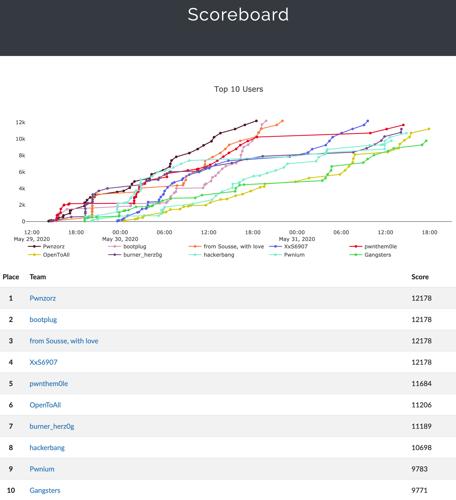

# CastorsCTF 2020
Fri, 29 May 2020, 14:00 MDT — Sun, 31 May 2020, 14:00 MDT 

<https://ctf20.cybercastors.com/>

Team: [burner_herz0g](https://ctftime.org/team/63292)

# Summary

## Reverse Engineering

* [ransom](ransom/)

## Pwnables

* [abcbof](abcbof/)
* [babybof1](babybof1/)
* [babybof2](babybof2/)

## Web

* [quiz](quiz/)

# Ranking

7th place out of 500 teams

# Lessons Learned

* Learned some more cool tricks for malware analysis, basic buffer overflow skills, and data exfiltration methods for vulnerable web services.

