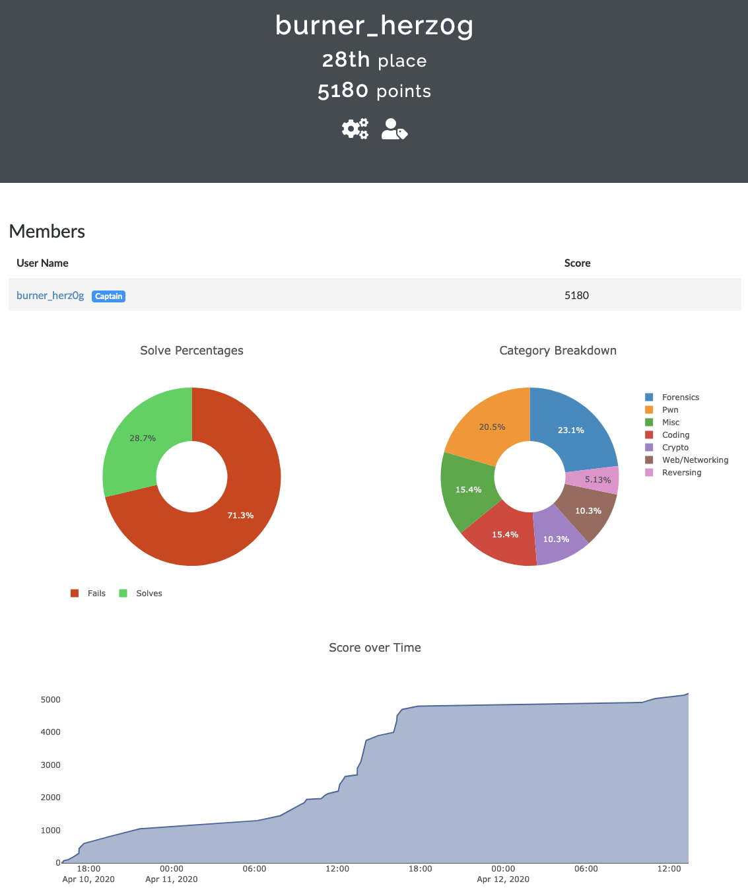

# DawgCTF 2020
Fri, 10 April 2020, 16:00 MDT — Sun, 12 April 2020, 16:00 MDT 

<https://umbccd.io>

Team: [burner_herz0g](https://ctftime.org/team/63292)

# Summary

I focused primarily on 2 reverse engineering challenges in this CTF. I solved the first one, but I ran into the time limit while still working on the second one.

1. <Put_your_thang_down_flip_it_and_reverse_it.txt>

2. <Ocean_Boutique.txt>

The real solution for Ocean Boutique can be found [here](https://github.com/toomanybananas/dawgctf-2020-writeups/tree/master/reversing/ocean-boutique). It looks like I was probably about 80% of the way there.

# Ranking
We placed 28th out of 1237 scoring teams.

# Lessons Learned

* Ghidra is great, but I need something like `angr.io` or `z3` to step up my binary analysis skills. It's far too labor intensive to rely on a line-by-line understanding of the code for problems like this with a fixed time limit. Even `gdb` was not particularly useful for Ocean Boutique.

