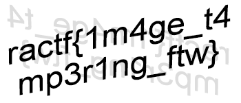

# Cut Short

## Description

```
This image refuses to open in anything, which is a bit odd. Open it for the flag!
```

Category: Forensics

## Analysis

I did a quick `apt-cache search` to see what png tools are available and found these:

```bash
kali@kali:~/Downloads/ractf/cut_short$ pngcheck flag.png 
flag.png  first chunk must be IHDR
ERROR: flag.png
kali@kali:~/Downloads/ractf/cut_short$ pngmeta flag.png 
libpng error: IEND: out of place
pngmeta: libpng read error for flag.png
```

Now let's take a look with `hexdump`:

```bash
kali@kali:~/Downloads/ractf/cut_short$ hd flag.png | head
00000000  89 50 4e 47 0d 0a 1a 0a  00 00 00 00 49 45 4e 44  |.PNG........IEND|
00000010  ae 42 60 82 00 00 00 0d  49 48 44 52 00 00 01 5e  |.B`.....IHDR...^|
00000020  00 00 00 96 08 06 00 00  00 96 e7 e0 77 00 00 20  |............w.. |
00000030  00 49 44 41 54 78 9c ed  9d 09 d4 b5 d5 f8 c6 77  |.IDATx.........w|
00000040  e6 79 9e 93 10 15 ca 50  49 86 a8 68 51 14 cb 90  |.y.....PI..hQ...|
00000050  8c 19 ca 94 b2 94 84 4a  a1 90 08 25 63 ad 0a 21  |.......J...%c..!|
00000060  91 a8 64 2e 85 84 92 95  31 63 32 65 cc 3c a6 ff  |..d.....1c2e.<..|
00000070  fa 1d e7 fe fe f7 b9 9f  7b ef 67 3f c3 79 ce 73  |........{.g?.y.s|
00000080  de 77 5f 6b 9d f5 7d ef  19 9f 61 ef 6b df fb ba  |.w_k..}...a.k...|
00000090  a7 b5 ae bc f2 ca 2b 43  41 41 41 41 c1 60 b8 4a  |......+CAAAA.`.J|
```

For comparison, here is what a healthy `.png` image looks like:

```bash
kali@kali:~/Downloads/ractf/cut_short$ pngcheck defenit.png 
OK: defenit.png (1500x944, 32-bit RGB+alpha, non-interlaced, 97.7%).
kali@kali:~/Downloads/ractf/cut_short$ pngmeta defenit.png 
pngmeta: PNG metadata for defenit.png:
kali@kali:~/Downloads/ractf/cut_short$ hd defenit.png | head
00000000  89 50 4e 47 0d 0a 1a 0a  00 00 00 0d 49 48 44 52  |.PNG........IHDR|
00000010  00 00 05 dc 00 00 03 b0  08 06 00 00 00 24 d3 b6  |.............$..|
00000020  7f 00 00 20 00 49 44 41  54 78 9c ec dd 0b 70 55  |... .IDATx....pU|
00000030  f5 bd ff fd 5f 2e 24 d9  c9 de 04 13 a8 0f 27 a1  |...._.$.......'.|
00000040  39 0e 43 68 0f 8c 28 38  10 b4 c3 ed 0f 9d d1 40  |9.Ch..(8.......@|
00000050  1c 28 0c 81 b6 b6 a6 9d  78 a9 3c b5 04 91 d1 47  |.(......x.<....G|
00000060  44 3c 3a c8 4d f8 07 6f  99 f3 04 e5 54 84 91 e2  |D<:.M..o....T...|
00000070  1c 76 52 67 0c 7f 2e 8e  d5 c0 23 28 0e 17 13 86  |.vRg......#(....|
00000080  c1 fc 25 87 3f 6a 22 c9  de 21 21 04 7c e6 bb c8  |..%.?j"..!!.|...|
00000090  b6 11 03 d9 49 d6 e5 b7  d6 7e bf 66 d2 76 2a ac  |....I....~.f.v*.|
```

In flag.png, IEND comes before IHDR, which seems wrong. What does it say in the spec?

* <http://www.libpng.org/pub/png/spec/1.2/PNG-Chunks.html>

"A valid PNG image must contain an IHDR chunk, one or more IDAT chunks, and an IEND chunk."

```
The IHDR chunk must appear FIRST. It contains:

   Width:              4 bytes
   Height:             4 bytes
   Bit depth:          1 byte
   Color type:         1 byte
   Compression method: 1 byte
   Filter method:      1 byte
   Interlace method:   1 byte
```

"The IEND chunk must appear LAST. It marks the end of the PNG datastream. The chunk's data field is empty."

Well, it already has an IEND chunk at the end:

```bash
kali@kali:~/Downloads/ractf/cut_short$ hd flag.png | tail
00003af0  f1 c5 61 fd f5 d7 9f a4  1a 97 ba b7 05 05 69 48  |..a...........iH|
00003b00  57 63 f4 54 88 ad 69 a7  8d d5 88 42 bc 05 05 05  |Wc.T..i....B....|
00003b10  05 03 a3 84 93 15 14 14  14 0c 8c 42 bc 05 05 05  |...........B....|
00003b20  05 03 a3 10 6f 41 41 41  c1 c0 28 c4 5b 50 50 50  |....oAAA..(.[PPP|
00003b30  30 30 0a f1 16 14 14 14  0c 8c 42 bc 05 05 05 05  |00........B.....|
00003b40  03 a3 10 6f 41 41 41 c1  c0 28 c4 5b 50 50 50 30  |...oAAA..(.[PPP0|
00003b50  30 0a f1 16 14 14 14 0c  89 10 c2 ff 01 bb 81 1f  |0...............|
00003b60  41 19 f7 a0 ca 00 00 00  00 49 45 4e 44 ae 42 60  |A........IEND.B`|
00003b70  82                                                |.|
00003b71
```

So we just need to remove the IEND chunk from the beginning of the flag.

From the head of the file:

```bash
kali@kali:~/Downloads/ractf/cut_short$ hd flag.png | head -2
00000000  89 50 4e 47 0d 0a 1a 0a  00 00 00 00 49 45 4e 44  |.PNG........IEND|
00000010  ae 42 60 82 00 00 00 0d  49 48 44 52 00 00 01 5e  |.B`.....IHDR...^|
```

We need to remove bytes 13 - 24:

```
49 45 4e 44 ae 42 60 82 00 00 00 0d
```

We can remove that with `dd`.

```bash
kali@kali:~/Downloads/ractf/cut_short$ dd if=flag.png of=flag2.png bs=1 count=12
12+0 records in
12+0 records out
12 bytes copied, 0.000200297 s, 59.9 kB/s
kali@kali:~/Downloads/ractf/cut_short$ hd flag2.png 
00000000  89 50 4e 47 0d 0a 1a 0a  00 00 00 00              |.PNG........|
0000000c
kali@kali:~/Downloads/ractf/cut_short$ dd if=flag.png bs=1 skip=24 >> flag2.png 
15193+0 records in
15193+0 records out
15193 bytes (15 kB, 15 KiB) copied, 0.0220703 s, 688 kB/s
kali@kali:~/Downloads/ractf/cut_short$ hd flag2.png | head -2
00000000  89 50 4e 47 0d 0a 1a 0a  00 00 00 00 49 48 44 52  |.PNG........IHDR|
00000010  00 00 01 5e 00 00 00 96  08 06 00 00 00 96 e7 e0  |...^............|
```

Run `pngcheck` on the new image... crap, there's another error.

```
kali@kali:~/Downloads/ractf/cut_short$ pngcheck flag2.png 
flag2.png  invalid IHDR length
ERROR: flag2.png
```

From comparing `defenit.png` to `flag2.png`, it looks like I got the IHDR chunk in the right place.

```bash
kali@kali:~/Downloads/ractf/cut_short$ hd defenit.png | head
00000000  89 50 4e 47 0d 0a 1a 0a  00 00 00 0d 49 48 44 52  |.PNG........IHDR|
00000010  00 00 05 dc 00 00 03 b0  08 06 00 00 00 24 d3 b6  |.............$..|
00000020  7f 00 00 20 00 49 44 41  54 78 9c ec dd 0b 70 55  |... .IDATx....pU|
00000030  f5 bd ff fd 5f 2e 24 d9  c9 de 04 13 a8 0f 27 a1  |...._.$.......'.|
00000040  39 0e 43 68 0f 8c 28 38  10 b4 c3 ed 0f 9d d1 40  |9.Ch..(8.......@|
00000050  1c 28 0c 81 b6 b6 a6 9d  78 a9 3c b5 04 91 d1 47  |.(......x.<....G|
00000060  44 3c 3a c8 4d f8 07 6f  99 f3 04 e5 54 84 91 e2  |D<:.M..o....T...|
00000070  1c 76 52 67 0c 7f 2e 8e  d5 c0 23 28 0e 17 13 86  |.vRg......#(....|
00000080  c1 fc 25 87 3f 6a 22 c9  de 21 21 04 7c e6 bb c8  |..%.?j"..!!.|...|
00000090  b6 11 03 d9 49 d6 e5 b7  d6 7e bf 66 d2 76 2a ac  |....I....~.f.v*.|
kali@kali:~/Downloads/ractf/cut_short$ hd flag2.png | head
00000000  89 50 4e 47 0d 0a 1a 0a  00 00 00 00 49 48 44 52  |.PNG........IHDR|
00000010  00 00 01 5e 00 00 00 96  08 06 00 00 00 96 e7 e0  |...^............|
00000020  77 00 00 20 00 49 44 41  54 78 9c ed 9d 09 d4 b5  |w.. .IDATx......|
00000030  d5 f8 c6 77 e6 79 9e 93  10 15 ca 50 49 86 a8 68  |...w.y.....PI..h|
00000040  51 14 cb 90 8c 19 ca 94  b2 94 84 4a a1 90 08 25  |Q..........J...%|
00000050  63 ad 0a 21 91 a8 64 2e  85 84 92 95 31 63 32 65  |c..!..d.....1c2e|
00000060  cc 3c a6 ff fa 1d e7 fe  fe f7 b9 9f 7b ef 67 3f  |.<..........{.g?|
00000070  c3 79 ce 73 de 77 5f 6b  9d f5 7d ef 19 9f 61 ef  |.y.s.w_k..}...a.|
00000080  6b df fb ba a7 b5 ae bc  f2 ca 2b 43 41 41 41 41  |k.........+CAAAA|
00000090  c1 60 b8 4a b9 d4 05 05  05 05 c3 a2 10 6f 41 41  |.`.J.........oAA|
```

What am I missing?

## Solution

At this point, I searched for more tools to help, and found PCRT:

* <https://github.com/sherlly/PCRT>

```bash
kali@kali:~/Downloads/ractf/cut_short$ git clone https://github.com/sherlly/PCRT.git
Cloning into 'PCRT'...
remote: Enumerating objects: 23, done.
remote: Total 23 (delta 0), reused 0 (delta 0), pack-reused 23
Unpacking objects: 100% (23/23), done.
kali@kali:~/Downloads/ractf/cut_short$ python PCRT/PCRT.py -i flag2.png -o flag3.png

         ____   ____ ____ _____
        |  _ \ / ___|  _ \_   _|
        | |_) | |   | |_) || |
        |  __/| |___|  _ < | |
        |_|    \____|_| \_\|_|

        PNG Check & Repair Tool

Project address: https://github.com/sherlly/PCRT
Author: sherlly
Version: 1.1

[Finished] Correct PNG header
Traceback (most recent call last):
  File "PCRT/PCRT.py", line 780, in <module>
    my_png.CheckPNG()
  File "PCRT/PCRT.py", line 424, in CheckPNG
    res=self.CheckIHDR(data)
  File "PCRT/PCRT.py", line 513, in CheckIHDR
    width,height=struct.unpack('!II',chunk_ihdr[:8])
struct.error: unpack requires a string argument of length 8
```

Ugh, I must have screwed up the IHDR or something. What about the original image?

```bash
kali@kali:~/Downloads/ractf/cut_short$ python PCRT/PCRT.py -i flag.png -o flag3.png

         ____   ____ ____ _____ 
        |  _ \ / ___|  _ \_   _|
        | |_) | |   | |_) || |  
        |  __/| |___|  _ < | |  
        |_|    \____|_| \_\|_|  

        PNG Check & Repair Tool 

Project address: https://github.com/sherlly/PCRT
Author: sherlly
Version: 1.1

[Finished] Correct PNG header
[Finished] Correct IHDR CRC (offset: 0x29): 96E7E077
[Finished] IHDR chunk check complete (offset: 0x14)
[Finished] Correct IDAT chunk data length (offset: 0x2D length: 2000)
[Finished] Correct IDAT CRC (offset: 0x2035): 3196B0B1
[Detected] Error IDAT chunk data length! (offset: 0x2039)
chunk length:1B20
actual length:1B2C
[Notice] Try fixing it? (y or n) [default:y] y
[Warning] Only fix because of DOS->Unix conversion
[Failed] Fixing failed, auto discard this operation...
[Finished] Correct IDAT chunk data length (offset: 0x3B71 length: 1B20)
[Finished] Correct IDAT CRC (offset: 0x5699): 19F7A0CA
[Finished] IDAT chunk check complete (offset: 0x2D)
[Finished] Correct IEND chunk
IHDR)cted] Some data (length: 15197) append in the end (
[Notice] Try extracting them in: <1>File <2>Terminal <3>Quit [default:3] 
[Finished] IEND chunk check complete
[Finished] PNG check complete
[Notice] Show the repaired image? (y or n) [default:n] y
kali@kali:~/Downloads/ractf/cut_short$ pngcheck flag3.png 
flag3.png  additional data after IEND chunk
ERROR: flag3.png
```

Sweet! That's good enough to get the flag.



The flag is:

```
ractf{1m4ge_t4mp3r1ng_ftw}
```

