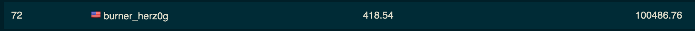

# Info
UCSB iCTF 2020:
Fri, 06 March 2020, 11:00 MST  Fri, 06 March 2020, 19:00 MST
https://all-you-need-is.ictf.love/howto
freenode channel: #ictf2020

# Summary
This was my first attack-defense style CTF. Leading up to this, I had only done jeopardy style CTF's, where you pull challenges off a board to try to score points. Attack-defense pits teams against each other to keep a set of vulnerable web services online while you attack your opponent's boxes. The goal of participating in this CTF was simply to understand the format and what you have to do to survive one of these. We had 4 people on our team.

The first hour or so was basically setup work. One team mate set up our vulnbox on AWS, while the rest of us followed along and started looking at the services in the VM image to get a feel for what we were dealing with. Once we had our services up, we focused on the `yellow_submarine` challenge, since it looked like the easiest one to start with.

We first started by trying to figure out how to patch it so that it couldn't be exploited by others. Then 2 of my team mates worked on developing an exploit for it while I threw together an automation script to attack other machines at scale using `swpag_client`. Once we had them working independently, one person glued them together. Unfortunately, the exploit that worked locally on our own vulnbox failed to get the right flag back from our opponent's boxes. It's still not clear to me why that is.

Meanwhile, our box was constantly getting DoS'd and fork bombed. A lot of the other teams were clearly thinking outside the box, using whatever method they could to knock our services offline and steal files / flags. Monitoring all this and responding should have been a full time job by itself for at least 1 person. Toward the end of the game, I threw togather a quick and dirty script to restart our services every couple of minutes because they kept going down. There be dragons here.

# Ranking
We placed 72nd out of 122 scoring teams and 268 registered teams.

That's not as terrible as I expected, considering that we didn't manage to pull off a successful exploit on an opponent's box. All our points came from keeping our vulnbox up and services online. We got beat up, but _man_ it was fun!

# Lessons Learned
* Most of the patching we tried was quick and simple, but we should use version control to do it in the future to make it easy to backout changes or revert to known working container version.
* The service restart loop that I threw together at the end was insufficient, and I should have used `swpag_client` to list the services for our team and only auto-restart the ones that are down. Should have been doing something like the whole time.
* Following on that, the attack script should have pulled data from `swpag_client` on every iteration and skipped the services that were down. Then retry only the attacks that fail to find and submit a valid flag.
* There's probably more we could have done on the firewall / networking side to stop or slow down attacks from other teams. For example, the teams that were attacking us often did so in rapid fire bursts (because scripting) and the service health check just ran once per tick (I think). Something like fail2ban or the right iptables rules would have helped significantly.
* We really need some well defined support roles and a larger team to do well in these sorts of competitions. Dedicated sysadmin(s) to monitor the server load and manage the firewall, blue team to patch and defend, red team to write exploits, and someone to write the automation framework so the others can focus on their key roles.

