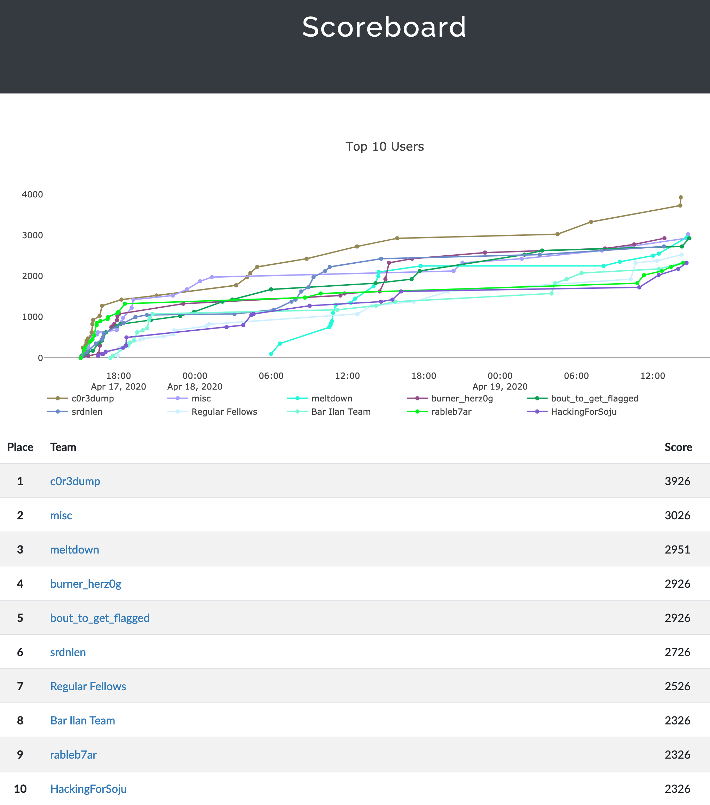
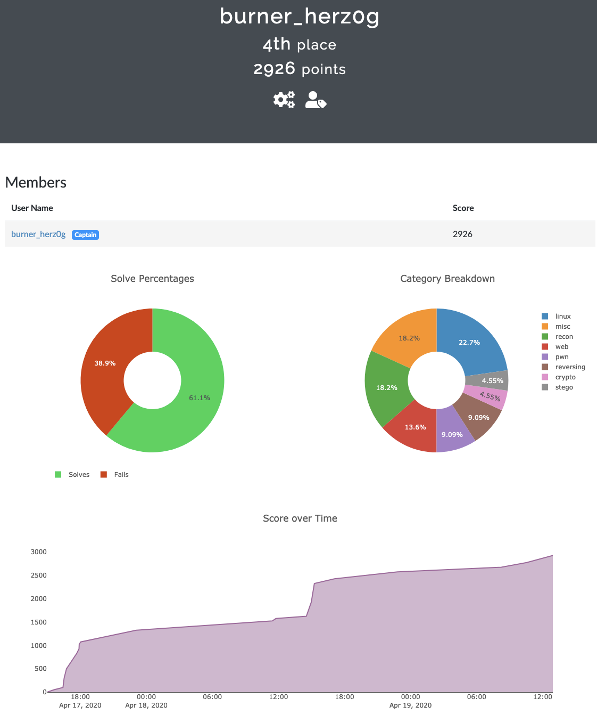
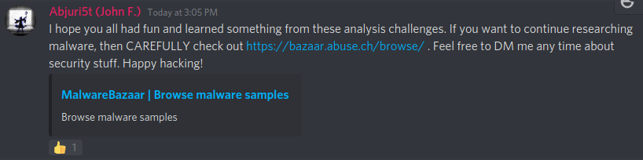

# WPICTF 2020
Fri, 17 April 2020, 15:00 MDT — Sun, 19 April 2020, 15:00 MDT

<https://wpictf.xyz/>

Team: [burner_herz0g](https://ctftime.org/team/63292)

# Summary

I focused most of my time on the following 3 challenges:

1. NotWannasigh (reversing)

2. danger-Live-and-Malicious-Code (reversing)

3. acurless_kdf (crypto) _INCOMPLETE_

I completed the first two and ran out of time on the third one.

# Ranking
We placed *4th* out of 925 registered teams and 619 scoring teams (>=25 pts).

# Lessons Learned

* Malware analysis challenges are pretty interesting, and there is a lot more to learn there :)

