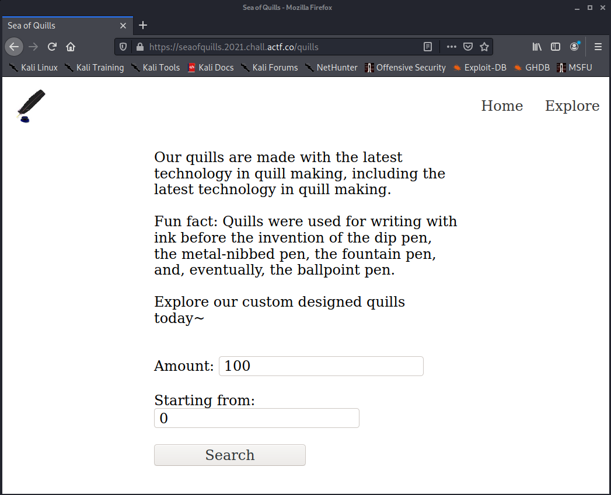
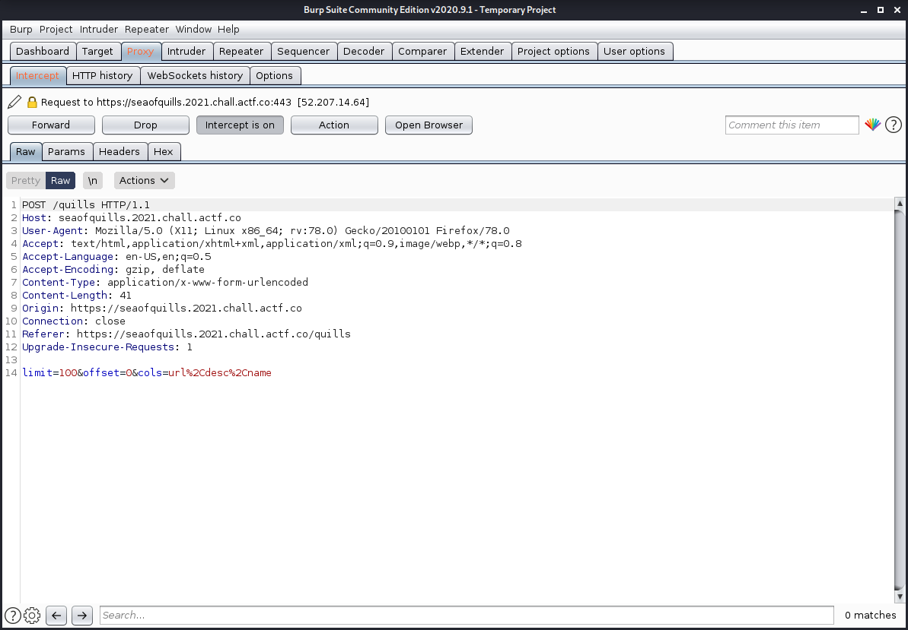
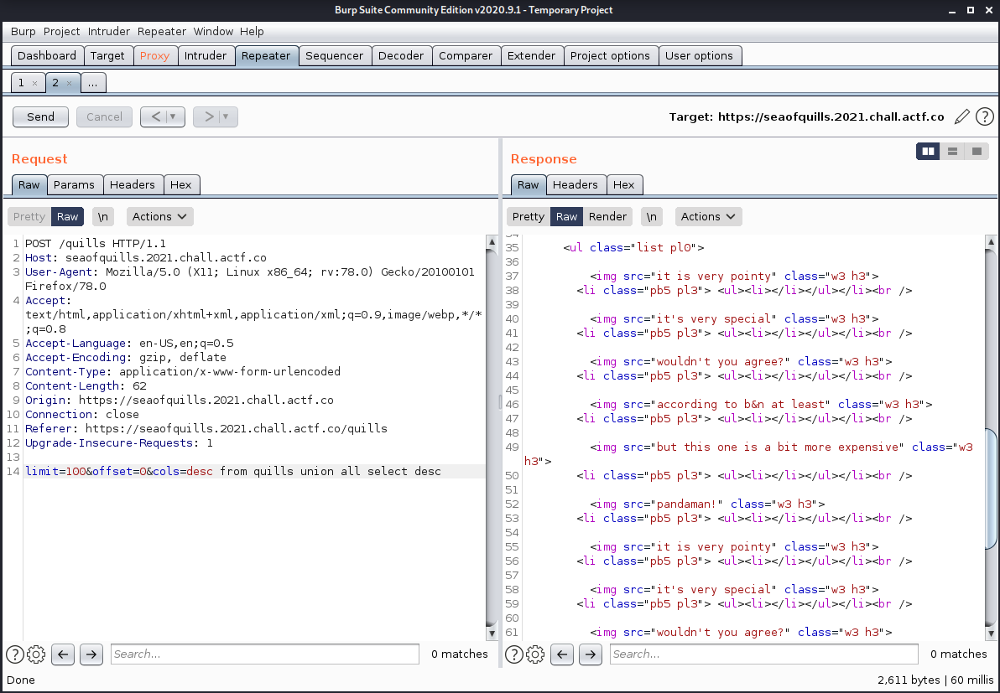
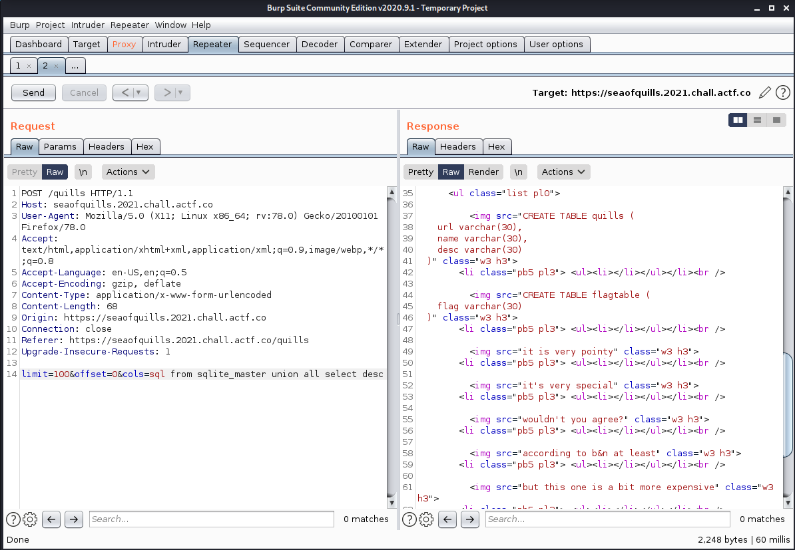

# Sea of Quills

## Description

```
Come check out our finest selection of quills!

app.rb

Author: JoshDaBosh
```

## Analysis

Here is the interesting part that handles the POST requests in `app.rb`:

```ruby
post '/quills' do
        db = SQLite3::Database.new "quills.db"
        cols = params[:cols]
        lim = params[:limit]
        off = params[:offset]

        blacklist = ["-", "/", ";", "'", "\""]

        blacklist.each { |word|
                if cols.include? word
                        return "beep boop sqli detected!"
                end
        }


        if !/^[0-9]+$/.match?(lim) || !/^[0-9]+$/.match?(off)
                return "bad, no quills for you!"
        end

        @row = db.execute("select %s from quills limit %s offset %s" % [cols, lim, off])

        p @row

        erb :specific
end
```

Go to the main page, click "Explore", and then do a simple search:



Intercept the POST request in Burp:



We control `limit` and `offset` from the search page, but enter any non-numeric characters and you'll get a bad response.

```ruby
        if !/^[0-9]+$/.match?(lim) || !/^[0-9]+$/.match?(off)
                return "bad, no quills for you!"
        end
```

But `cols` is fair game as long as we don't use any of these characters:

```ruby
        blacklist = ["-", "/", ";", "'", "\""]
```

Can we do a `union`?



That works. Now we need to see what other tables might be there, which we can do with `sql from sqlite_master`.



And there's our flag table!

## Solution

All that's left to do is use the union to get `flag from flagtable`:


The flag is:

```
actf{and_i_was_doing_fine_but_as_you_came_in_i_watch_my_regex_rewrite_f53d98be5199ab7ff81668df}
```

