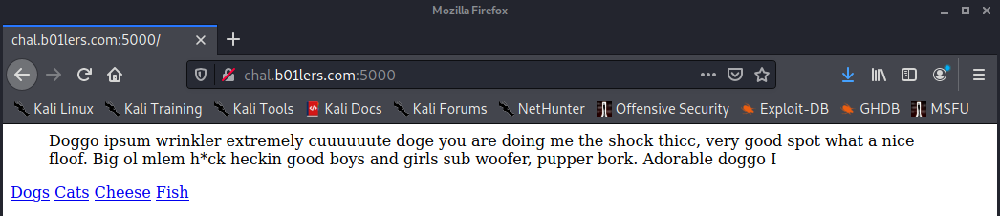
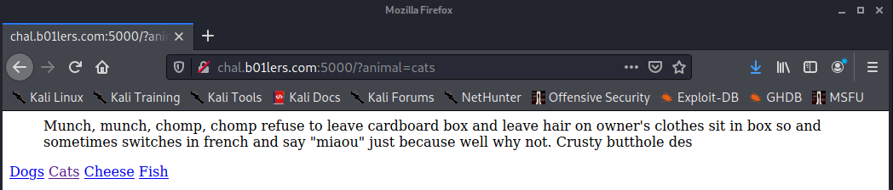
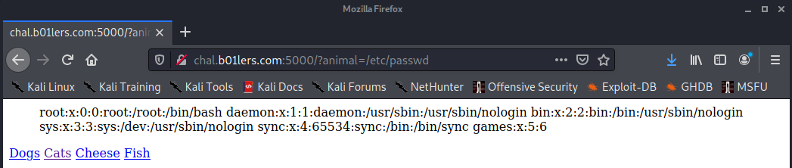
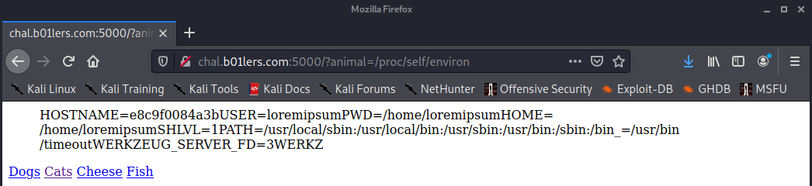
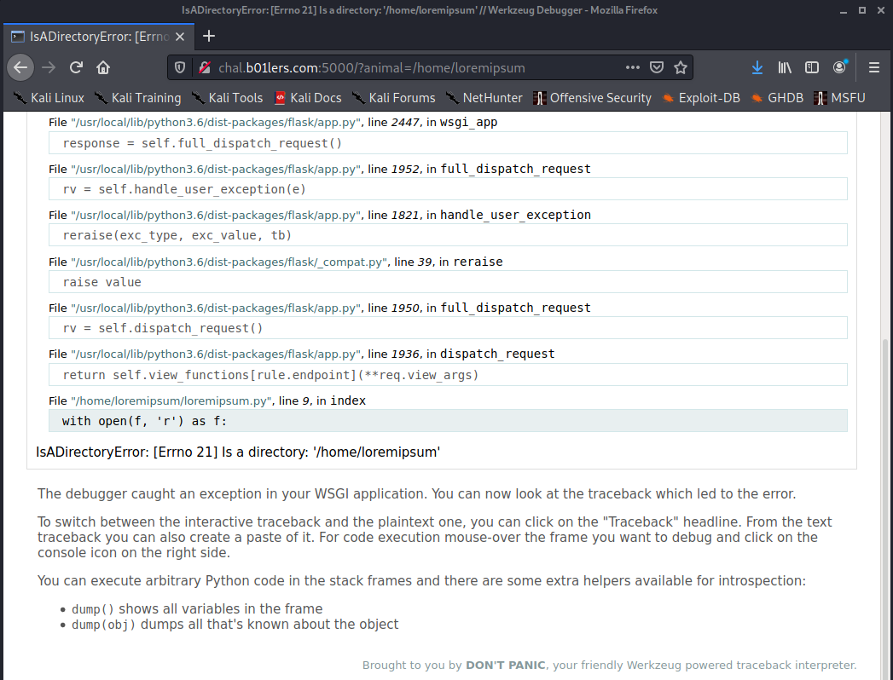
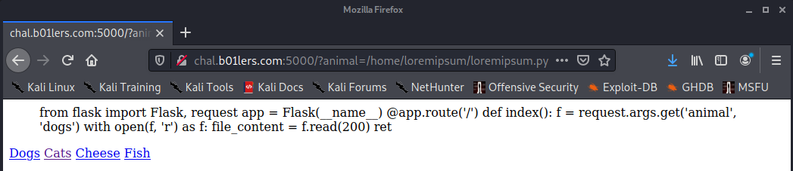
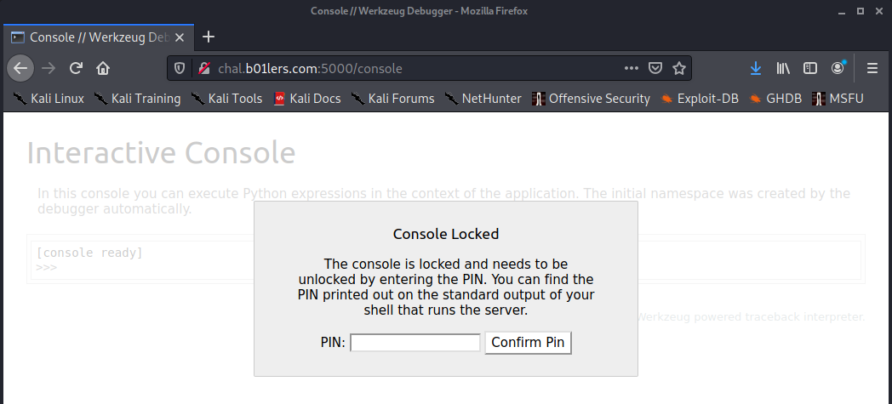
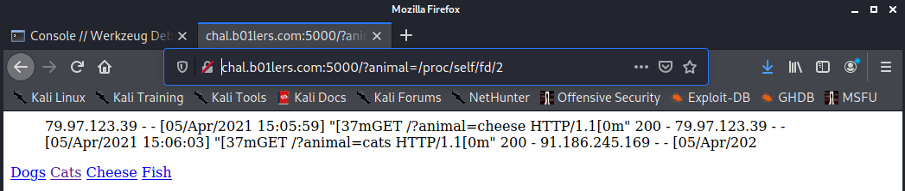
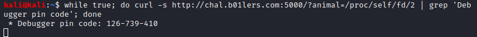
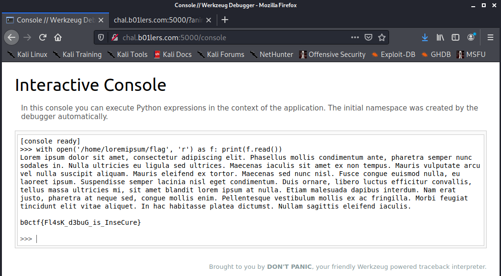

# lorem_ipsum

## Description

```
Here's a quick animal-based lorem ipsum generator. Unfortunately, it will only give you 200 characters of content for each animal.

chal.b01lers.com:5000

by nsnc
```

## Analysis

Go to the page. It just spits some text out with a few links at the bottom.



Click on one of the links and get some different text back.



Credit goes to my team mate [bigpick](https://github.com/bigpick) for figuring out the LFI. We can get the first 200 chars of `/etc/passwd`:



And dump out a few environment variables from `/proc/self/environ`:



Now we know the username and home directory. What happens if we just put a directory name in for the file path?



Ooooh yay, a traceback! Debugging is enabled, so we can get a python console!

From that output we know the path to the source code is `/home/loremipsum/loremipsum.py`, and we can dump out the first 200 chars using the LFI to see what it's doing on the backend:



Now go to the console page. You could use the traceback page we saw earlier, but when debugging is enabled on a flask app you can also reach the console at `/console`.



Now we need to get the PIN to access the console. It says that is printed out on standard output, but flask actually prints to `stderr` for whatever reason, which we can read using `/proc/self/fd/2`:



## Solution

We can only read 200 bytes at a time, and new log messages are constantly being written to `stderr`, so write a simple loop to keep fetching the contents of `/proc/self/fd/2` and grep for `Debugger pin code`. Then keep hitting refresh on the console page until you get the PIN from the curl loop.



Then paste that PIN into the console page and use this to get the flag:

```
>>> with open('/home/loremipsum/flag', 'r') as f: print(f.read())
```



The flag is:

```
b0ctf{Fl4sK_d3buG_is_InseCure}
```

