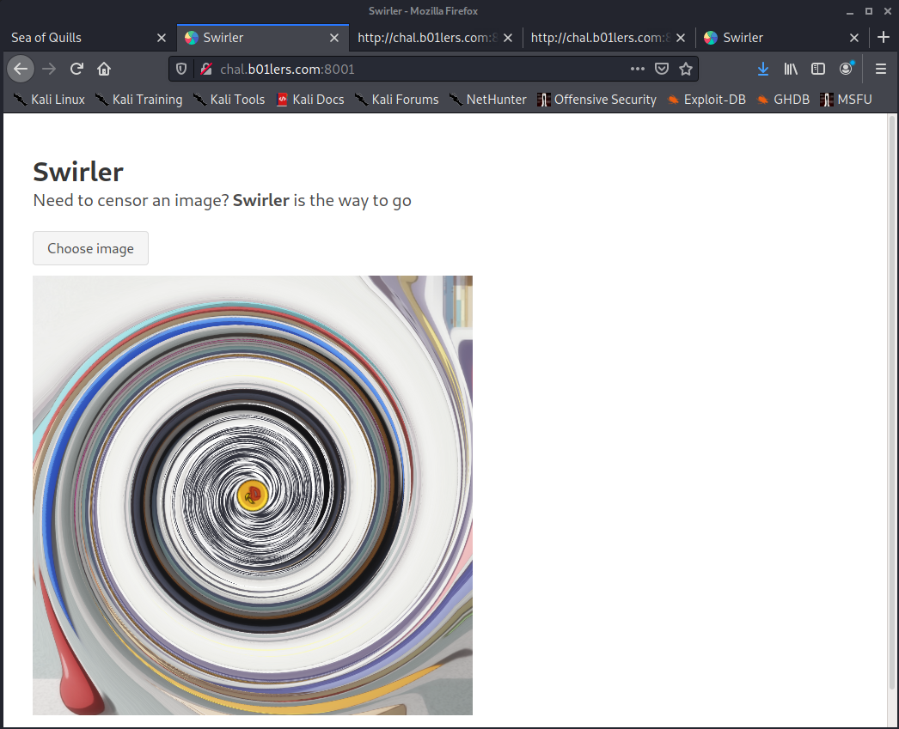
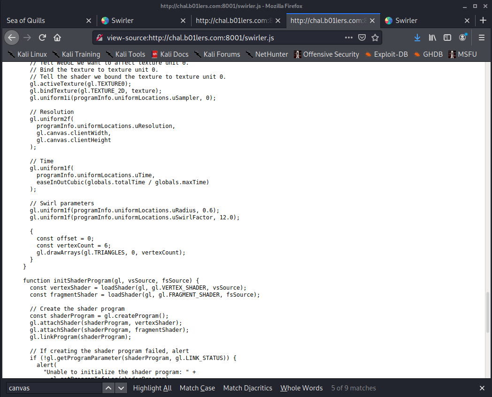
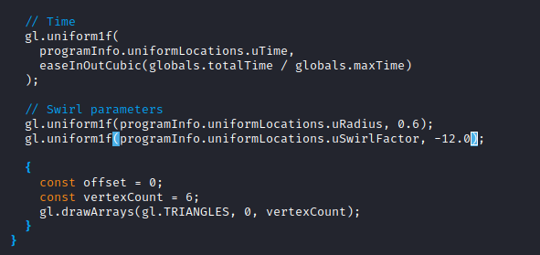
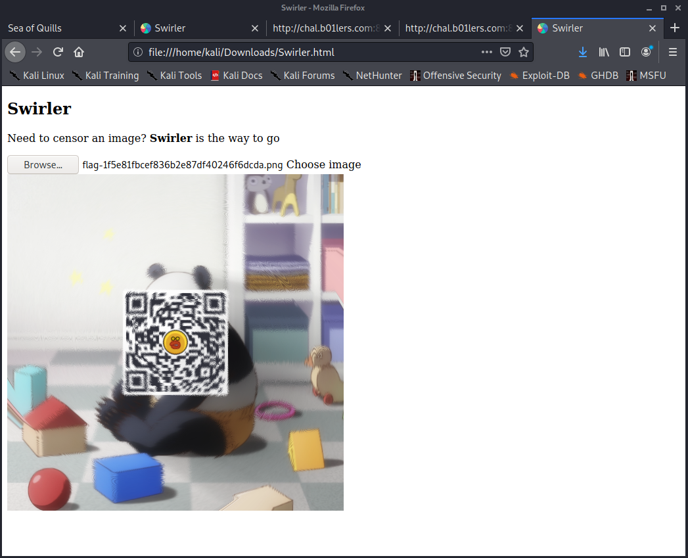

# swirler

## Description

```
Should we make this one swirling-as-a-service?

Difficulty: Easy

chal.b01lers.com:8001

by qxxxb

Thanks to Buckeye Bureau of BOF!
```

## Analysis

Alright, we got this swirly looking flag image. I think we know where this is going:


Go to the site. It lets you upload an image to swirl:


If you upload `flag.png`, it gets even more swirly:



Take a look at the source code. Not much there.


But this is all client-side stuff. Check out `swirler.js`:



The "Swirl parameters" look interesting. Save a local copy of the site to modify the js code.

## Solution

Change `uSwirlFactor` to `-12.0` to reverse the swirl.



Now upload `flag.png` again, and we get a QR code:



Scanning that QR code takes us to <https://gist.github.com/qxxxb/d22119c274b5d5d6383e5fc09a490c04>

The flag is:

```
pctf{sw1rly_sw1rly_qr_c0d3}
```

