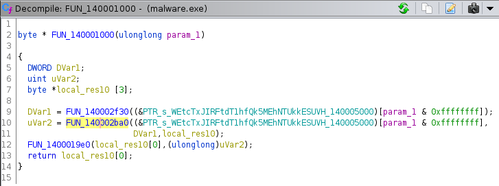
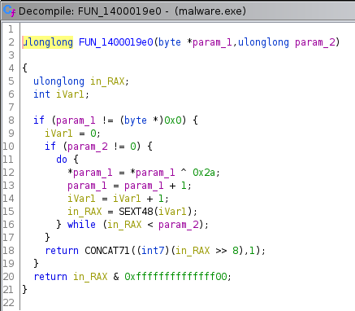

# malware/danceparty-1 (rev)

Author: captainGeech

## Description

```
A new IR came in hot off the press and we found some fresh malware! It looks like the adversaries were stealing sensitive information from the client environment but we aren't sure yet.

Can you look at this malware and examine the configuration?

NOTE: This is real malware (created for this event), handle with care and don't blindly run it. There are safeguards in place to protect accidental infection but don't rely on them. The ZIP password is infected.
```

Downloads: `files.zip`

## Analysis

The zip only contains `malware.exe`:

```
$ file malware.exe        
malware.exe: PE32+ executable (console) x86-64, for MS Windows
```

The flag has to be in the binary somewhere, so I started with strings:

```
$ strings malware.exe
...
WEtcTxJIRFtdT1hfQk5MEhNTUkkESUVH
WEtcT04dSB0ZX0RSSRJQElBZBERPXg==
WEtcT0BcGRJNU0RCHFAETk8=
BEdakspil0BwWPgstow7jg==
TktHUU4ZGVp1TFgbT051R09HGlhTdUwaWHVOHlNQVw==
XkFYHRob
...
passwords
invoices
flag
C:\Users\*
```

Those were the interesting ones. The first 6 strings above are base64 encoded, and the last 4 might be filenames... `flag` is something to look at and see what code references it.

Decode each base64 string:

```
$ for i in WEtcTxJIRFtdT1hfQk5MEhNTUkkESUVH WEtcT04dSB0ZX0RSSRJQElBZBERPXg== WEtcT0BcGRJNU0RCHFAETk8= BEdakspil0BwWPgstow7jg== TktHUU4ZGVp1TFgbT051R09HGlhTdUwaWHVOHlNQVw== XkFYHRob; do echo $i | base64 -d; echo ""; done
XK\OHD[]OX_BNLSRIIEG
XK\ONH_DRIPPYDO^
XK\O@\MSDBPNO
GZ��b�@pX�,��;�
NKGQNZuLXNuGOGXSuLXuNSPW
^AX
```

That's not really useful yet, there's another layer to get through.

## Solution

This is kind of a lame and guessy approach, but I just threw "magic" at those base64 strings and got lucky:

<https://gchq.github.io/CyberChef/#recipe=From_Base64('A-Za-z0-9%2B/%3D',true)Magic(3,true,false,'dam%7B')&input=VGt0SFVVNFpHVnAxVEZnYlQwNTFSMDlIR2xoVGRVd2FXSFZPSGxOUVZ3PT0>

From that, we find out the base64 decoded strings are xor'd with 42 (or 0x2a).

<https://gchq.github.io/CyberChef/#recipe=From_Base64('A-Za-z0-9%2B/%3D',true)XOR(%7B'option':'Hex','string':'2a'%7D,'Standard',false)&input=VGt0SFVVNFpHVnAxVEZnYlQwNTFSMDlIR2xoVGRVd2FXSFZPSGxOUVZ3PT0>

The flag is:

```
dam{d33p_fr1ed_mem0ry_f0r_d4yz}
```

All 6 of those base64 strings decoded using the same approach:

```
rave8bnqweruhdf89yxc.com
raved7b73unxc8z8zs.net
ravejv38gynh6z.de
.mp¸àH½jZrÒ..¦.¤
dam{d33p_fr1ed_mem0ry_f0r_d4yz}
tkr701
```

Those look like clues for danceparty-2.

`malware.exe` is nicely obsfucated, so it's not easy to make sense of what's going on, but the other (less guessy) approach I see to figure out how those strings are decoded is by looking at references to the base64 strings.

`FUN_140001000` for example (from Ghidra) decodes one of those base64 strings:



and then it passes the string of bytes into `FUN_1400019e0`, which xor's each byte with `0x2a`:



So from that you could write a small script to decode each one.

```python3
#!/usr/bin/env python3
import base64

b64in = [
    "WEtcTxJIRFtdT1hfQk5MEhNTUkkESUVH",
    "WEtcT04dSB0ZX0RSSRJQElBZBERPXg==",
    "WEtcT0BcGRJNU0RCHFAETk8=",
    "BEdakspil0BwWPgstow7jg==",
    "TktHUU4ZGVp1TFgbT051R09HGlhTdUwaWHVOHlNQVw==",
    "XkFYHRob"
]

for entry in b64in:
    x = base64.b64decode(entry)
    d = bytes([x[i] ^ 0x2a for i in range(len(x))])
    print(d)
```

```
$ ./solve.py 
b'rave8bnqweruhdf89yxc.com'
b'raved7b73unxc8z8zs.net'
b'ravejv38gynh6z.de'
b'.mp\xb8\xe0H\xbdjZr\xd2\x06\x9c\xa6\x11\xa4'
b'dam{d33p_fr1ed_mem0ry_f0r_d4yz}'
b'tkr701'
```

